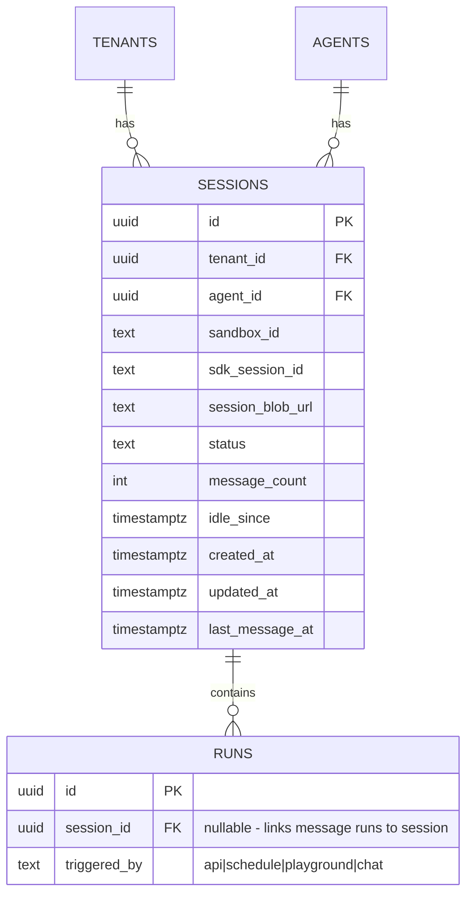

# Add Persistent Chat Sessions

## Enhancement Summary

**Deepened on:** 2026-03-09
**Review agents used:** 13 (architecture-strategist, performance-oracle, security-sentinel, data-integrity-guardian, kieran-typescript-reviewer, pattern-recognition-specialist, code-simplicity-reviewer, julik-frontend-races-reviewer, agent-native-reviewer, silent-failure-hunter, best-practices-researcher, framework-docs-researcher, deployment-verification-agent)

### Critical Issues Found

1. **Security: Vercel Blob files may be publicly accessible** — Session files containing full conversation history could be exposed. Must use signed URLs or private blob access.
2. **TOCTOU race on session status** — `after()` callback creates a gap between response end and `idle` transition where cleanup cron could race. Session file backup must be synchronous (before response ends), not async.
3. **Missing `creating→idle` transition** — Session creation without initial prompt needs `creating→idle` (not just `creating→active`).
4. **Concurrent session/run limits overlap** — A session with an active message counts toward both session limit (5) AND run limit (10). These interact in non-obvious ways.
5. **`sandbox_id` leaks in API responses** — Internal Vercel sandbox IDs should never appear in tenant-facing API responses.
6. **`NOT VALID` + `VALIDATE` in same transaction negates the benefit** — Separate these into distinct statements or migration steps.
7. **`triggered_by` constraint name is auto-generated** — Migration 010 added it as an inline unnamed constraint. Postgres auto-generates a name (likely `runs_triggered_by_check` but NOT guaranteed). Must verify exact name before deploying migration 014 or the `DROP CONSTRAINT IF EXISTS` silently does nothing, leaving old constraint that rejects `'chat'`.
8. **Vercel Blob server upload limit is 4.5MB** — Session files could exceed this for long conversations. Must use `multipart: true` or client upload pattern.
9. **Session file backup failure creates a data loss timebomb** — If backup fails and sandbox later dies, all context since last successful backup is lost. No retry mechanism described.
10. **Agent deletion during active session** — `ON DELETE CASCADE` deletes session row while sandbox keeps running. Finalization silently fails on deleted row.

### Key Improvements to Implement

1. Add mutex/lock on session row before processing messages (not just status check)
2. Make session file backup synchronous (complete before transitioning to `idle`)
3. Use discriminated union return types in SDK instead of `Promise<Session | RunStream>`
4. Add `session_id` filter support to existing `GET /api/runs` endpoint
5. Cap session file size and add growth monitoring
6. Add `GET /api/sessions/:id/status` lightweight polling endpoint
7. Handle MCP token expiry across long-lived sessions (tokens may expire between messages)
8. Add session message cancellation support (cancel in-flight message without stopping session)
9. Ensure `cleanup-sandboxes` cron excludes session-owned sandboxes
10. Use `sandbox.extendTimeout()` on each message instead of fixed 30-min timeout
11. Use `multipart: true` for Blob uploads of session files (4.5MB server upload limit)
12. Track `last_backup_at` in session row to detect stale backups
13. Verify exact `triggered_by` constraint name from production DB before deploying migration 014
14. Add watchdog for stuck `creating` (>5 min) and `active` (>30 min) sessions in cleanup cron
15. Wrap agent deletion in explicit session cleanup before CASCADE

## Overview

Add persistent multi-turn chat sessions to AgentPlane. Currently every run is fire-and-forget: new sandbox, single `query()`, stream results, destroy sandbox. Sessions keep sandboxes alive across messages and use the Claude Agent SDK's native `resume: sessionId` option for full conversation context preservation.

The API supports **both one-shot runs and sessions** side by side. `POST /api/runs` remains one-shot (backward compatible). Sessions are a new first-class resource with their own lifecycle.

## Problem Statement / Motivation

AgentPlane agents are stateless — each run starts from scratch with no memory of previous interactions. This prevents:

- **Iterative workflows**: Users can't refine agent output across multiple turns
- **Conversational context**: Agents can't reference prior work, decisions, or code
- **Interactive exploration**: Users can't ask follow-up questions naturally
- **Agent memory**: No continuity between interactions

The Claude Agent SDK already supports session resumption natively via `resume: sessionId`. AgentPlane just needs to stop destroying sandboxes between turns and wire up the session lifecycle.

## Proposed Solution

### Architecture: Per-Message Runner Script

Each message writes a fresh `runner-<N>.mjs` to the sandbox and executes it via `sandbox.runCommand()`. The runner calls `query({ prompt, options: { resume: sessionId } })`. No persistent process, HTTP server, or stdin pipe needed inside the sandbox.

**Hot path** (sandbox alive):
1. Write `runner-<N>.mjs` with `resume: sessionId`
2. `sandbox.runCommand({ cmd: "node", args: ["runner-N.mjs"], detached: true })`
3. Stream NDJSON events from command logs
4. SDK loads session `.jsonl` file from disk automatically

**Cold path** (sandbox dead, session still active):
1. Create new sandbox, install SDK, inject skills/plugins/MCP config
2. Restore session `.jsonl` file from Vercel Blob → sandbox filesystem
3. Execute runner with `resume: sessionId`
4. SDK resumes with full conversation context

### SDK Options for Context Retention

The runner script passes **all** agent configuration options on every `query()` call. The SDK handles context restoration from the session file:

```typescript
const options = {
  model: config.model,
  permissionMode: config.permissionMode,
  allowedTools: config.allowedTools, // retained across messages
  mcpServers: config.mcpServers,    // retained across messages
  settingSources: ["project"],       // skills/plugins loaded from disk
  maxTurns: config.maxTurns,
  maxBudgetUsd: perMessageBudget,
  includePartialMessages: true,
  resume: sdkSessionId,             // null on first message
};
```

Skills, plugins, MCP servers, and connectors are all configured per-sandbox (written to disk / passed as options), so they persist across messages in the same sandbox. On cold start, they're re-injected from the agent config.

### Hot vs Cold Start Optimization

| Scenario | What happens | Latency |
|----------|-------------|---------|
| **Hot start** (sandbox alive, no MCP) | Write runner script, `runCommand()`, SDK reads session + skills from disk | ~2-4s |
| **Hot start** (sandbox alive, with MCP) | Same + re-establish MCP connections | ~3-6s |
| **Warm start** (sandbox dead, session file in Blob) | Create sandbox + npm install + write files + restore session file + `runCommand()` | ~8-15s |
| **Cold start** (new session) | Create sandbox + npm install + write files + first `query()` | ~8-15s |

Hot starts are fast because:
- SDK is already installed (no `npm install`)
- Skills/plugins/commands already on disk (SDK reads via `settingSources: ['project']`, only reloads if file mtime changed — which it won't between messages)
- Agent config (model, permissions, tools) is passed per-message in the runner script — no platform round-trip
- Session context restored from disk by SDK's `resume: sessionId` — reads `.jsonl` file directly
- Only a new runner script (~1KB) is written and executed

**What IS re-established per message (unavoidable with per-message process model):**
- Node.js process startup (~300ms)
- SDK initialization + skill discovery from disk (~200ms)
- MCP server TCP connections (~1-2s per server, since MCP connection state is not persisted in session file)
- Session `.jsonl` parsing (grows with conversation length)

**What is NOT reloaded (efficient):**
- Skills, commands, plugin files — already on sandbox filesystem, no re-fetch from platform
- SDK npm package — already installed
- Agent configuration — embedded in runner script, no DB/API call
- Sandbox itself — `Sandbox.get()` reconnects in ~300ms

> **Research Insight — Performance:** Hot start estimate of ~1-2s is optimistic for agents with MCP servers. Realistic: **~2-4s without MCP, ~3-6s with MCP servers** (due to re-establishing connections). Benchmark in real sandbox before committing to SLA. Session `.jsonl` files grow linearly — a 50-message session could be 500KB+. Add a `session_file_size` metric and cap at 200 messages.

> **Research Insight — `extendTimeout()` optimization:** Instead of fixed 30-min sandbox timeout, start with 10-min timeout and call `sandbox.extendTimeout(10 * 60 * 1000)` on each new message. This way idle sandboxes auto-stop sooner, reducing cost. Vercel Sandbox bills **Active CPU only** — idle time costs only provisioned memory (~$0.003 per 10 min for 2 vCPU).

> **Research Insight — MCP Token Expiry:** Long-lived sessions (30+ min) may outlive MCP OAuth tokens. On each message, check token expiry and refresh before writing the runner script. Pass refreshed `MCP_SERVERS_JSON` env var per-message (already in the design — env is per `runCommand()` call). Add `mcpTokenRefreshedAt` tracking to session metadata.

> **Research Insight — ToolSearch + MCP Lazy Discovery:** `ENABLE_TOOL_SEARCH=true` is already set in the sandbox env. This enables the SDK's deferred tool discovery — it doesn't load all MCP tool schemas upfront but discovers them on demand via `tool_reference` content blocks. This is especially valuable for sessions with many MCP servers: tools are only resolved when Claude actually wants to use them, reducing per-message startup overhead. MCP connections are still established at `query()` startup (the SDK connects to all configured servers), but tool schema loading is deferred. There is currently no SDK option to defer MCP server *connections* themselves (lazy connect only when a tool is called). The per-message process model means connections are re-established each time.

> **Research Insight — Parallel MCP Token Refresh:** `src/lib/mcp.ts:94-121` refreshes OAuth tokens for custom MCP servers **sequentially** (`for...of` with `await`). With N MCP servers, this is Nx latency. **Fix: use `Promise.allSettled()` to refresh all tokens in parallel.** This benefits both one-shot runs and session hot starts. The SDK likely connects to MCP servers in parallel internally (unconfirmed), but we should confirm with a benchmark. The Composio MCP setup (line 32-80) is a single call and cannot be parallelized further, but it CAN run in parallel with custom MCP token refreshes — currently they run sequentially (Composio first, then custom servers). Restructure to run both in parallel:
>
> ```typescript
> const [composioResult, customResult] = await Promise.allSettled([
>   buildComposioConfig(agent, tenantId),
>   buildCustomMcpConfig(agent, tenantId), // internal: parallel token refresh
> ]);
> ```

> **Research Insight — v2 Persistent Process:** To eliminate MCP reconnection cost, a future optimization could keep a long-running Node.js process in the sandbox that accepts messages via file watch or Unix socket. This would keep MCP connections alive across messages. The SDK exposes `reconnectMcpServer(serverName)` and `setMcpServers(servers)` for runtime MCP management on a live `Query` object. Deferred to v2 — per-message process is simpler and sufficient for v1.

### One-Shot vs Session API Design

Both modes coexist. The existing runs API is unchanged:

```
# One-shot (existing, unchanged)
POST /api/runs              → fire-and-forget, sandbox destroyed after

# Session-based (new)
POST /api/sessions          → create session (optional initial message)
POST /api/sessions/:id/messages  → send message within session
GET  /api/sessions/:id      → session metadata + message history
DELETE /api/sessions/:id    → stop session, destroy sandbox
```

The `POST /api/runs` endpoint does NOT accept a `session_id`. Sessions and runs are separate resources with different lifecycles. Runs within a session are created automatically by the message endpoint and are visible via `GET /api/runs?session_id=<id>`.

## Technical Approach

### Phase 1: Data Model

#### Migration `014_sessions_table.sql`

```sql
CREATE TABLE IF NOT EXISTS sessions (
  id              UUID PRIMARY KEY DEFAULT gen_random_uuid(),
  tenant_id       UUID NOT NULL,
  agent_id        UUID NOT NULL,
  sandbox_id      TEXT,                    -- NULL when hibernated
  sdk_session_id  TEXT,                    -- captured from SDK init message
  session_blob_url TEXT,                   -- Vercel Blob URL for backed-up session file
  status          TEXT NOT NULL DEFAULT 'creating'
                  CHECK (status IN ('creating', 'active', 'idle', 'stopped')),
  message_count   INT NOT NULL DEFAULT 0,
  idle_since      TIMESTAMPTZ,
  created_at      TIMESTAMPTZ NOT NULL DEFAULT now(),
  updated_at      TIMESTAMPTZ NOT NULL DEFAULT now(),
  last_message_at TIMESTAMPTZ,

  CONSTRAINT fk_sessions_agent_tenant FOREIGN KEY (agent_id, tenant_id)
    REFERENCES agents(id, tenant_id) ON DELETE CASCADE
);

-- Indexes
CREATE INDEX idx_sessions_tenant ON sessions (tenant_id);
CREATE INDEX idx_sessions_agent ON sessions (agent_id);
CREATE INDEX idx_sessions_idle ON sessions (status, idle_since)
  WHERE status = 'idle';

-- RLS
ALTER TABLE sessions ENABLE ROW LEVEL SECURITY;
ALTER TABLE sessions FORCE ROW LEVEL SECURITY;
CREATE POLICY tenant_isolation ON sessions
  FOR ALL TO app_user
  USING (tenant_id = NULLIF(current_setting('app.current_tenant_id', true), '')::uuid)
  WITH CHECK (tenant_id = NULLIF(current_setting('app.current_tenant_id', true), '')::uuid);

-- Trigger
CREATE TRIGGER sessions_updated_at
  BEFORE UPDATE ON sessions
  FOR EACH ROW EXECUTE FUNCTION set_updated_at();

-- Permissions
GRANT SELECT, INSERT, UPDATE, DELETE ON sessions TO app_user;

-- Add session_id FK to runs (for messages-as-runs)
ALTER TABLE runs ADD COLUMN IF NOT EXISTS session_id UUID;
ALTER TABLE runs ADD CONSTRAINT fk_runs_session
  FOREIGN KEY (session_id) REFERENCES sessions(id) ON DELETE SET NULL
  NOT VALID;
ALTER TABLE runs VALIDATE CONSTRAINT fk_runs_session;
CREATE INDEX IF NOT EXISTS idx_runs_session ON runs (session_id) WHERE session_id IS NOT NULL;

-- Add 'chat' to triggered_by CHECK constraint
-- CRITICAL: The constraint was added as an inline unnamed constraint in migration 010.
-- Postgres auto-generates the name. MUST verify the actual name before deploying:
--   SELECT conname FROM pg_constraint WHERE conrelid = 'runs'::regclass
--     AND contype = 'c' AND pg_get_constraintdef(oid) ILIKE '%triggered_by%';
-- If the name differs from 'runs_triggered_by_check', update the DROP below.
ALTER TABLE runs DROP CONSTRAINT IF EXISTS runs_triggered_by_check;
ALTER TABLE runs ADD CONSTRAINT runs_triggered_by_check
  CHECK (triggered_by IN ('api', 'schedule', 'playground', 'chat'))
  NOT VALID;
ALTER TABLE runs VALIDATE CONSTRAINT runs_triggered_by_check;
```

#### ERD



#### Session State Machine

```
creating → active        (first message sent successfully)
creating → stopped       (creation failed or cancelled)
active   → idle          (message completed, sandbox stays alive)
idle     → active        (new message arrives)
idle     → stopped       (idle timeout cleanup or explicit stop)
active   → stopped       (explicit stop, budget exhausted, agent deleted)
```

Note: `idle` means "sandbox alive, waiting for next message." `stopped` is terminal. There is no separate "hibernated" state — when the cleanup cron stops an idle sandbox, it backs up the session file and marks the session `stopped`. To continue, the client creates a new session (or we add a `POST /api/sessions/:id/resume` in v2).

> **Research Insight — Architecture:** The `creating→idle` transition is missing from the state machine. When `POST /api/sessions` is called **without** a prompt, the session goes `creating→idle` (sandbox provisioned, waiting for first message). Add this to `SESSION_VALID_TRANSITIONS`. Also consider: if `stopped` is truly terminal and sessions can never resume, the entire backup/restore infrastructure is only needed for sandbox crashes during an active session. This is still valuable but the scope is narrower than it appears. The cold-start restore path is primarily a reliability feature, not a user-facing resume feature.

> **Research Insight — Simplicity:** Consider whether `creating` state is needed at all. If sandbox provisioning is synchronous within the request handler, the session could start as `idle` (no prompt) or `active` (with prompt) directly. `creating` only adds value if provisioning is async/backgrounded. If kept, ensure the API returns 202 Accepted (not 200) for `creating` sessions.

#### Branded Types

**File:** `src/lib/types.ts`

```typescript
export type SessionId = string & { readonly __brand: "SessionId" };
export type SessionStatus = "creating" | "active" | "idle" | "stopped";
export type RunTriggeredBy = "api" | "schedule" | "playground" | "chat";

export const SESSION_VALID_TRANSITIONS: Record<SessionStatus, SessionStatus[]> = {
  creating: ["active", "stopped"],
  active: ["idle", "stopped"],
  idle: ["active", "stopped"],
  stopped: [],
};
```

#### Validation Schemas

**File:** `src/lib/validation.ts`

```typescript
export const SessionStatusSchema = z.enum(["creating", "active", "idle", "stopped"]);
export const RunTriggeredBySchema = z.enum(["api", "schedule", "playground", "chat"]);

export const CreateSessionSchema = z.object({
  agent_id: z.string().uuid(),
  prompt: z.string().min(1).max(100_000).optional(), // optional first message
  max_idle_minutes: z.number().int().min(1).max(60).optional(), // per-session idle TTL override
});

export const SessionRow = z.object({
  id: z.string(),
  tenant_id: z.string(),
  agent_id: z.string(),
  sandbox_id: z.string().nullable(),
  sdk_session_id: z.string().nullable(),
  session_blob_url: z.string().nullable(),
  status: SessionStatusSchema,
  message_count: z.coerce.number(),
  idle_since: z.coerce.string().nullable(),
  created_at: z.coerce.string(),
  updated_at: z.coerce.string(),
  last_message_at: z.coerce.string().nullable(),
});

export const SendMessageSchema = z.object({
  prompt: z.string().min(1).max(100_000),
  max_turns: z.number().int().min(1).max(1000).optional(),
  max_budget_usd: z.number().min(0.01).max(100.0).optional(),
});

// Update RunRow to include session_id
// RunRow: add session_id: z.string().nullable().default(null)
```

> **Research Insight — Security:** `SessionRow` must NOT expose `sandbox_id` in tenant-facing API responses. Strip it in the API route handler (not in the schema). The schema should include it for internal use, but the response serializer should omit it. Pattern: use a separate `SessionResponse` schema for API output that excludes `sandbox_id` and `session_blob_url`.

> **Research Insight — Data Integrity:** The `NOT VALID` + `VALIDATE` pattern for `fk_runs_session` and the updated `runs_triggered_by_check` should be in **separate statements** (not wrapped in a single transaction). Running them together negates the lock-avoidance benefit. The migration already shows them as separate `ALTER TABLE` statements which is correct — just ensure the migration runner doesn't wrap the whole file in a transaction. Verify against the existing migration runner behavior in `src/db/migrate.ts`.

### Phase 2: Session DB Helpers

**New file:** `src/lib/sessions.ts`

Follow the pattern from `src/lib/runs.ts`:

```typescript
// Session concurrency limit
const MAX_CONCURRENT_SESSIONS = 5;

export async function createSession(
  tenantId: TenantId,
  agentId: AgentId,
): Promise<{ session: Session; agent: AgentInternal }> {
  // Atomic: verify agent exists, check concurrent session limit, insert
  return withTenantTransaction(tenantId, async (tx) => {
    const agent = await tx.queryOne(AgentRowInternal, `SELECT ... FROM agents WHERE id = $1`, [agentId]);
    if (!agent) throw new NotFoundError("Agent not found");

    // Atomic concurrent session check (same pattern as run concurrency)
    const result = await tx.queryOne(SessionRow, `
      INSERT INTO sessions (tenant_id, agent_id, status)
      SELECT $1, $2, 'creating'
      WHERE (SELECT COUNT(*) FROM sessions WHERE tenant_id = $1 AND status IN ('creating', 'active', 'idle')) < $3
      RETURNING *
    `, [tenantId, agentId, MAX_CONCURRENT_SESSIONS]);

    if (!result) throw new ConcurrencyLimitError("Maximum concurrent sessions reached");
    return { session: result, agent };
  });
}

export async function getSession(sessionId: SessionId, tenantId: TenantId) { ... }
export async function listSessions(tenantId: TenantId, opts: { agentId?, status?, limit, offset }) { ... }
export async function transitionSessionStatus(sessionId, tenantId, from, to, updates?) { ... }
export async function stopSession(sessionId: SessionId, tenantId: TenantId) { ... }
export async function getIdleSessions(maxIdleMinutes: number) { ... } // no RLS, for cron
```

### Phase 3: Session-Aware Sandbox & Runner

#### Session Sandbox Creation

**File:** `src/lib/sandbox.ts` — new function `createSessionSandbox(config)`

Same as `createSandbox()` but:
- Does NOT write/execute `runner.mjs` (sandbox stays warm)
- Uses a longer timeout (30 min, configurable)
- Returns the sandbox instance for later `runCommand()` calls

```typescript
export interface SessionSandboxConfig {
  agent: SandboxConfig["agent"];
  tenantId: string;
  sessionId: string;
  platformApiUrl: string;
  aiGatewayApiKey: string;
  mcpServers?: Record<string, McpServerConfig>;
  mcpErrors?: string[];
  pluginFiles?: Array<{ path: string; content: string }>;
  maxIdleTimeoutMs?: number; // default 30 min
}

export async function createSessionSandbox(config: SessionSandboxConfig): Promise<SessionSandboxInstance> {
  // 1. Create sandbox (same provisioning as createSandbox)
  // 2. Write skills/plugins to disk
  // 3. Install SDK
  // 4. Do NOT run any command yet
  // 5. Return sandbox with runMessage() helper
}
```

#### Session Sandbox Instance

```typescript
export interface SessionSandboxInstance extends SandboxInstance {
  runMessage(prompt: string, opts: {
    sdkSessionId?: string;     // null on first message
    runId: string;
    runToken: string;
    maxTurns: number;
    maxBudgetUsd: number;
  }): { logs: () => AsyncIterable<string> };
}
```

The `runMessage()` method:
1. Writes `runner-<runId>.mjs` to the sandbox
2. Calls `sandbox.runCommand({ cmd: "node", args: ["runner-<runId>.mjs"], detached: true, env })`
3. Returns log iterator

#### Session Runner Script

**File:** `src/lib/sandbox.ts` — new function `buildSessionRunnerScript(config)`

```typescript
function buildSessionRunnerScript(config: SessionRunnerConfig): string {
  const agentConfig = {
    model: config.agent.model,
    permissionMode: config.agent.permission_mode,
    allowedTools: config.agent.allowed_tools,
    maxTurns: config.maxTurns,
    maxBudgetUsd: config.maxBudgetUsd,
    settingSources: config.hasSkillsOrPlugins ? ["project"] : [],
    includePartialMessages: true,
  };

  return `
import { query } from '@anthropic-ai/claude-agent-sdk';
import { writeFileSync, appendFileSync } from 'fs';

const config = ${JSON.stringify(agentConfig)};
const prompt = ${JSON.stringify(config.prompt)};
const sdkSessionId = ${JSON.stringify(config.sdkSessionId)}; // null on first message

const mcpServers = process.env.MCP_SERVERS_JSON
  ? JSON.parse(process.env.MCP_SERVERS_JSON)
  : {};

const transcriptPath = '/vercel/sandbox/transcript.ndjson';
writeFileSync(transcriptPath, '');

function emit(event) {
  const line = JSON.stringify(event);
  console.log(line);
  appendFileSync(transcriptPath, line + '\\n');
}

async function main() {
  emit({
    type: 'run_started',
    run_id: process.env.AGENTPLANE_RUN_ID,
    agent_id: process.env.AGENTPLANE_AGENT_ID,
    model: config.model,
    timestamp: new Date().toISOString(),
    session_id: sdkSessionId,
  });

  const options = {
    ...config,
    ...(Object.keys(mcpServers).length > 0 ? { mcpServers } : {}),
    ...(sdkSessionId ? { resume: sdkSessionId } : {}),
  };

  try {
    for await (const message of query({ prompt, options })) {
      if (message.type === 'system' && message.subtype === 'init' && message.session_id) {
        // Emit session info for the platform to capture
        emit({ type: 'session_info', sdk_session_id: message.session_id });
      }
      if (message.type === 'stream_event') {
        const ev = message.event;
        if (ev.type === 'content_block_delta' && ev.delta?.type === 'text_delta') {
          console.log(JSON.stringify({ type: 'text_delta', text: ev.delta.text }));
        }
      } else {
        emit(message);
      }
    }
  } catch (err) {
    emit({ type: 'error', error: err.message || String(err), code: 'execution_error' });
  }

  // Upload transcript for detached runs
  if (process.env.AGENTPLANE_PLATFORM_URL && process.env.AGENTPLANE_RUN_TOKEN) {
    try {
      const { readFileSync } = await import('fs');
      const transcript = readFileSync(transcriptPath);
      await fetch(process.env.AGENTPLANE_PLATFORM_URL + '/api/internal/runs/' + process.env.AGENTPLANE_RUN_ID + '/transcript', {
        method: 'POST',
        headers: {
          'Authorization': 'Bearer ' + process.env.AGENTPLANE_RUN_TOKEN,
          'Content-Type': 'application/x-ndjson',
        },
        body: transcript,
      });
    } catch (err) {
      console.error('Failed to upload transcript:', err.message);
    }
  }
}

main().catch(err => { console.error('Runner fatal error:', err); process.exit(1); });
`;
}
```

### Phase 4: Session Executor

**New file:** `src/lib/session-executor.ts`

```typescript
export interface SessionExecutionParams {
  sessionId: SessionId;
  tenantId: TenantId;
  agent: AgentInternal;
  prompt: string;
  platformApiUrl: string;
  effectiveBudget: number;
  effectiveMaxTurns: number;
}

/**
 * Prepare a session sandbox (create or reconnect).
 * Returns the sandbox instance ready for runMessage().
 */
export async function prepareSessionSandbox(
  params: SessionExecutionParams,
  session: Session,
): Promise<SessionSandboxInstance> {
  if (session.sandbox_id) {
    // Hot path: try to reconnect
    const sandbox = await reconnectSessionSandbox(session.sandbox_id);
    if (sandbox) return sandbox;
    // Sandbox gone — fall through to cold path
  }

  // Cold path: create new sandbox
  const [mcpResult, pluginResult] = await Promise.all([
    buildMcpConfig(params.agent, params.tenantId),
    fetchPluginContent(params.agent.plugins ?? []),
  ]);

  const sandbox = await createSessionSandbox({
    agent: { ...params.agent, max_budget_usd: params.effectiveBudget, max_turns: params.effectiveMaxTurns },
    tenantId: params.tenantId,
    sessionId: params.sessionId,
    platformApiUrl: params.platformApiUrl,
    aiGatewayApiKey: getEnv().AI_GATEWAY_API_KEY,
    mcpServers: mcpResult.servers,
    mcpErrors: mcpResult.errors,
    pluginFiles: [...pluginResult.skillFiles, ...pluginResult.commandFiles],
  });

  // Restore session file from Blob if resuming
  if (session.sdk_session_id && session.session_blob_url) {
    await restoreSessionFile(sandbox, session.session_blob_url, session.sdk_session_id);
  }

  return sandbox;
}

/**
 * Execute a single message within a session.
 * Creates a run, streams events, captures session ID, backs up session file.
 */
export async function executeSessionMessage(
  params: SessionExecutionParams,
  sandbox: SessionSandboxInstance,
  session: Session,
): Promise<RunExecutionResult> {
  // 1. Create run record with session_id and triggered_by: "chat"
  // 2. sandbox.runMessage(prompt, { sdkSessionId, runId, ... })
  // 3. Capture session_info event → update session.sdk_session_id
  // 4. Return log iterator + transcript chunks
}

/**
 * Finalize a session message: persist transcript, update run, update session.
 * Does NOT stop sandbox.
 */
export async function finalizeSessionMessage(
  runId: RunId,
  tenantId: TenantId,
  sessionId: SessionId,
  transcriptChunks: string[],
  effectiveBudget: number,
): Promise<void> {
  // 1. Persist transcript (same as finalizeRun)
  // 2. Update run status
  // 3. Update session: last_message_at, message_count++, status → idle, idle_since
  // 4. Async: back up session file to Vercel Blob
}
```

### Phase 5: Session File Persistence

**New file:** `src/lib/session-files.ts`

```typescript
/**
 * Back up the SDK session file from sandbox to Vercel Blob.
 * Called after each message completes — MUST complete before response ends (see Research Insight below).
 * IMPORTANT: Use { multipart: true } for Blob put() — server uploads are limited to 4.5MB,
 * and session files for long conversations can exceed this.
 */
export async function backupSessionFile(
  sandbox: SessionSandboxInstance,
  tenantId: TenantId,
  sessionId: SessionId,
  sdkSessionId: string,
): Promise<string> {
  // Read ~/.claude/projects/<cwd>/<sdk_session_id>.jsonl from sandbox
  // Upload to Vercel Blob at sessions/{tenantId}/{sessionId}/{sdkSessionId}.jsonl
  // Return blob URL
}

/**
 * Restore a session file from Vercel Blob into a new sandbox.
 * Called during cold start when sandbox was destroyed but session is active.
 */
export async function restoreSessionFile(
  sandbox: SessionSandboxInstance,
  blobUrl: string,
  sdkSessionId: string,
): Promise<void> {
  // Download from Blob
  // Write to sandbox at ~/.claude/projects/<cwd>/<sdk_session_id>.jsonl
  // SDK's resume option will find it automatically
}
```

Session file backup happens **after every message**.

> **Research Insight — CRITICAL: Backup must be synchronous, not in `after()`.** The `after()` callback runs after the response is sent to the client. If the session transitions to `idle` in `after()`, there's a TOCTOU window where: (1) response ends, (2) cleanup cron sees `idle` session, (3) cron stops sandbox, (4) `after()` tries to back up session file from a stopped sandbox → data loss. **Fix:** Complete session file backup and `idle` transition BEFORE ending the response stream. The backup can overlap with the last chunk of streaming (pipelined), but must complete before the response closes. Alternatively, use `SELECT ... FOR UPDATE` in the cron to lock the session row, and have the message handler hold the lock until backup completes.

> **Research Insight — Performance:** Session file backup grows O(n) with conversation length. A 100-message session could have a 1MB+ session file. For v1, this is fine (Blob uploads are fast). For v2, consider incremental/delta backups or compressed uploads.

### Phase 6: API Routes

#### Tenant Session Routes

**`src/app/api/sessions/route.ts`** — `POST` (create), `GET` (list)

```typescript
// POST /api/sessions
// Body: { agent_id: string, prompt?: string }
// Response (no prompt): JSON { id, agent_id, status, created_at }
// Response (with prompt): NDJSON stream (session_created event + message events)
export const POST = withErrorHandler(async (request: NextRequest) => {
  const auth = await authenticateApiKey(request.headers.get("authorization"));
  const input = CreateSessionSchema.parse(await request.json());

  const { session, agent } = await createSession(auth.tenantId, input.agent_id as AgentId);

  // Provision sandbox (warm it up)
  const sandbox = await prepareSessionSandbox({ ... }, session);

  // Update session with sandbox_id
  await transitionSessionStatus(session.id, auth.tenantId, "creating", "idle", {
    sandbox_id: sandbox.id,
  });

  if (input.prompt) {
    // Execute first message and stream response
    // ... (create run, stream NDJSON, transition session to active)
  } else {
    return jsonResponse({ ...session, sandbox_id: undefined }); // don't expose sandbox_id
  }
});

// GET /api/sessions?agent_id=<id>&status=<status>
export const GET = withErrorHandler(async (request: NextRequest) => { ... });
```

**`src/app/api/sessions/[sessionId]/route.ts`** — `GET` (detail), `DELETE` (stop)

```typescript
// GET /api/sessions/:id
// Returns session metadata + linked runs (message history)
export const GET = withErrorHandler(async (request, context) => { ... });

// DELETE /api/sessions/:id
// Backs up session file, stops sandbox, marks session stopped
export const DELETE = withErrorHandler(async (request, context) => { ... });
```

**`src/app/api/sessions/[sessionId]/messages/route.ts`** — `POST` (send message)

```typescript
// POST /api/sessions/:id/messages
// Body: { prompt: string, max_turns?: number, max_budget_usd?: number }
// Response: NDJSON stream
export const POST = withErrorHandler(async (request, context) => {
  const auth = await authenticateApiKey(request.headers.get("authorization"));
  const { sessionId } = await context!.params;
  const input = SendMessageSchema.parse(await request.json());

  const session = await getSession(sessionId as SessionId, auth.tenantId);
  if (!session) throw new NotFoundError("Session not found");
  if (session.status === "stopped") throw new ConflictError("Session is stopped");

  // Check if session is currently processing (active status = message in flight)
  if (session.status === "active") throw new ConflictError("Session is processing a message");

  // Transition to active (atomic, prevents concurrent messages)
  await transitionSessionStatus(sessionId, auth.tenantId,
    session.status, // "idle" or "creating"
    "active"
  );

  // Budget check (also checks run concurrency — a session message creates a run)
  const remainingBudget = await checkTenantBudget(auth.tenantId);

  // Get or create sandbox
  const sandbox = await prepareSessionSandbox({ ... }, session);

  // Create run record
  const { run } = await createRun(auth.tenantId, session.agent_id as AgentId, input.prompt, {
    triggeredBy: "chat",
    sessionId: sessionId as SessionId,
  });

  // Execute message
  const { logIterator, transcriptChunks } = await executeSessionMessage({ ... }, sandbox, session);

  // Stream NDJSON (reuse existing infrastructure)
  const stream = createNdjsonStream({ runId: run.id, logIterator, onDetach: () => { ... } });

  // NOTE: Do NOT use after() for session file backup — see Research Insight in Phase 5.
  // Backup + idle transition must complete before response ends to prevent
  // TOCTOU race with cleanup cron.
  // Use stream's onEnd callback to trigger backup synchronously within the response lifecycle.

  return new Response(stream, { status: 200, headers: ndjsonHeaders() });
});
```

> **Research Insight — Frontend Races:** The message endpoint must enforce single-writer semantics. The `active` status check + transition is necessary but not sufficient if two requests arrive simultaneously. Use `SELECT ... FOR UPDATE` on the session row to serialize access. The `transitionSessionStatus()` helper should use an atomic `UPDATE ... WHERE status = $expected RETURNING *` pattern (matching the existing `runs.ts` pattern). If 0 rows updated, another request won.

> **Research Insight — Agent-Native Parity:** Add `session_id` as an optional filter to the existing `GET /api/runs` endpoint. This lets clients (and agents) list all messages within a session without a dedicated `/sessions/:id/messages` endpoint. Also support message cancellation: `DELETE /api/sessions/:id/messages/current` (or `POST /api/runs/:runId/cancel` with session awareness — don't stop the session, just cancel the in-flight message and transition back to `idle`).

#### Admin Session Routes

**`src/app/api/admin/sessions/route.ts`** — `GET` (list all sessions)
**`src/app/api/admin/sessions/[sessionId]/route.ts`** — `GET`, `DELETE`
**`src/app/api/admin/agents/[agentId]/sessions/route.ts`** — `POST` (playground session create)
**`src/app/api/admin/sessions/[sessionId]/messages/route.ts`** — `POST` (playground message)

Follow exact same patterns as existing admin run routes.

> **Research Insight — Pattern Consistency:** Ensure admin session routes mirror the admin run routes exactly: same auth middleware (`requireAdmin`), same response shapes, same pagination. The playground session create should use `triggered_by: "playground"` (not `"chat"`) for messages initiated from the admin playground, matching the existing run source tracking pattern.

#### Middleware

**File:** `src/middleware.ts`

- `/api/sessions/*` routes automatically fall into the tenant API auth zone (Bearer token) — no changes needed
- `/api/admin/sessions/*` routes automatically fall into the admin auth zone (JWT cookie) — no changes needed

### Phase 7: Cleanup Cron

**New file:** `src/app/api/cron/cleanup-sessions/route.ts`

```typescript
// GET /api/cron/cleanup-sessions
// Runs every 5 minutes
// 1. Find sessions: status = 'idle' AND idle_since < NOW() - INTERVAL '10 minutes'
// 2. For each: SELECT ... FOR UPDATE SKIP LOCKED
// 3. Back up session file to Blob
// 4. Stop sandbox
// 5. Mark session 'stopped'
export const GET = withErrorHandler(async (request: NextRequest) => {
  verifyCronSecret(request);

  const idleSessions = await getIdleSessions(10); // 10 min idle timeout

  for (const session of idleSessions) {
    // Lock row to prevent race with incoming messages
    // Back up session file
    // Stop sandbox
    // Transition to stopped
  }

  return jsonResponse({ cleaned: idleSessions.length });
});
```

**File:** `vercel.json` — add cron entry:

```json
{ "path": "/api/cron/cleanup-sessions", "schedule": "*/5 * * * *" }
```

**File:** `src/app/api/cron/cleanup-sandboxes/route.ts` — update to skip session sandboxes (sandboxes whose ID matches an active/idle session).

> **Research Insight — Deployment Safety:** The cleanup-sessions cron is a new critical path. Ensure it has:
> 1. **Idempotency** — safe to run multiple times (use `FOR UPDATE SKIP LOCKED`)
> 2. **Observability** — log each session cleaned with `session_id`, `sandbox_id`, `idle_duration_seconds`
> 3. **Error isolation** — one failed session cleanup should not abort the entire batch (wrap each in try/catch)
> 4. **Monitoring** — alert if sessions accumulate in `idle` state beyond 2x the idle timeout (indicates cron failure)
> 5. **Graceful degradation** — if Blob upload fails during backup, still stop the sandbox but log a warning (don't leave sandbox running forever)

### Phase 8: Admin Playground Chat UI

**File:** `src/app/admin/(dashboard)/agents/[agentId]/playground/page.tsx`

Transform from one-shot prompt box to chat interface:

- **State**: `sessionId | null`, `messages[]`, `isStreaming`, `sessionStatus`
- **New Session button** → POST `/api/admin/agents/:id/sessions`
- **Message input** at bottom → POST `/api/admin/sessions/:id/messages`
- **Message list** with user/assistant bubbles (user message + streamed response)
- **Tool use/result events** rendered inline (collapsible, same as current)
- **Session status indicator** (creating → active → idle → stopped)
- **End Session button** → DELETE
- **Loading states**: "Provisioning sandbox..." during create, "Restoring session..." during cold start

Keep backward compatibility: a "Quick Run" tab stays one-shot for ad-hoc testing.

### Phase 9: SDK Updates

#### SDK Session Resource

**New file:** `sdk/src/resources/sessions.ts`

```typescript
export class SessionsResource {
  constructor(private readonly _client: AgentPlane) {}

  /**
   * Create a session. If prompt is provided, returns a RunStream for the first message.
   * Use overloads for type-safe return types.
   */
  async create(params: CreateSessionParams & { prompt: string }): Promise<RunStream>;
  async create(params: CreateSessionParams & { prompt?: undefined }): Promise<Session>;
  async create(params: CreateSessionParams): Promise<Session | RunStream> {
    if (params.prompt) {
      return this._client._requestStream("POST", "/sessions", { body: params });
    }
    return this._client._request<Session>("POST", "/sessions", { body: params });
  }

  async get(sessionId: string): Promise<Session> { ... }
  async list(params?: ListSessionsParams): Promise<PaginatedResponse<Session>> { ... }
  async sendMessage(sessionId: string, params: SendMessageParams): Promise<RunStream> { ... }
  async stop(sessionId: string): Promise<void> { ... }
}
```

#### SDK Types

**File:** `sdk/src/types.ts`

```typescript
export interface Session {
  id: string;
  agent_id: string;
  tenant_id: string;
  status: "creating" | "active" | "idle" | "stopped";
  message_count: number;
  created_at: string;
  updated_at: string;
  last_message_at: string | null;
}

export interface CreateSessionParams {
  agent_id: string;
  prompt?: string; // optional first message
}

export interface SendMessageParams {
  prompt: string;
  max_turns?: number;
  max_budget_usd?: number;
}

export interface ListSessionsParams extends PaginationParams {
  agent_id?: string;
  status?: string;
}

// Update Run to include optional session_id
export interface Run {
  // ... existing fields
  session_id: string | null;
  triggered_by: "api" | "schedule" | "playground" | "chat";
}
```

#### SDK Client

**File:** `sdk/src/client.ts`

```typescript
export class AgentPlane {
  readonly sessions: SessionsResource;
  // ... existing resources
}
```

#### SDK Tests

**New file:** `sdk/tests/resources/sessions.test.ts`

Test: create, get, list, sendMessage, stop — following patterns from `sdk/tests/resources/runs.test.ts`.

> **Research Insight — TypeScript:** Use method overloads (shown above) instead of `Promise<Session | RunStream>` union. This gives callers compile-time type safety based on whether `prompt` is provided. Also: `SessionSandboxInstance extends SandboxInstance` inherits `logs()` which is meaningless for session sandboxes (they don't have a single long-running command). Use composition instead of inheritance — `SessionSandboxInstance` should have its own interface with `runMessage()` and `stop()` but not `logs()`.

### Phase 10: Documentation Updates

#### CLAUDE.md

**File:** `CLAUDE.md` — update these sections:

- **Core concepts**: Add **Session** — persistent multi-turn conversation with sandbox kept alive across messages; uses Claude Agent SDK `resume: sessionId`
- **Execution flow**: Add session message flow (reconnect sandbox, `query({ resume })`, stream, finalize without stopping sandbox)
- **Project Structure**: Add session files (`src/lib/sessions.ts`, `src/lib/session-executor.ts`, `src/lib/session-files.ts`, `src/app/api/sessions/`, `src/app/api/admin/sessions/`, `src/app/api/cron/cleanup-sessions/`, `sdk/src/resources/sessions.ts`)
- **Database**: Add `sessions` table, `runs.session_id` FK, `triggered_by` values
- **API Authentication**: Note session routes follow tenant auth pattern
- **Sandbox & Runner**: Add session sandbox lifecycle (warm sandbox, per-message runner scripts, session file backup/restore)
- **Patterns & Conventions**: Add session state machine, concurrent session limit (5), idle timeout (10 min), session file persistence to Vercel Blob
- **SDK resource namespaces**: Add `client.sessions`

#### README

**File:** `README.md` (if it exists, or root documentation)

- Add "Chat Sessions" section in features
- Add session API usage examples
- Document one-shot vs session mode choice

#### SDK README

**File:** `sdk/README.md`

- Add `Sessions` section with code examples:
  - Create session: `await client.sessions.create({ agent_id: "..." })`
  - Send message: `for await (const event of client.sessions.sendMessage(sessionId, { prompt: "..." })) { ... }`
  - Stop session: `await client.sessions.stop(sessionId)`
  - List sessions: `await client.sessions.list({ agent_id: "..." })`

#### SDK Types Documentation

**File:** `sdk/src/types.ts` — add JSDoc comments to all new interfaces

## Acceptance Criteria

### Functional Requirements

- [x] `POST /api/sessions` creates a session and provisions a sandbox
- [x] `POST /api/sessions` with `prompt` creates session + streams first message response
- [x] `POST /api/sessions/:id/messages` sends a message and streams NDJSON response
- [x] `GET /api/sessions/:id` returns session metadata and linked runs
- [x] `GET /api/sessions?agent_id=X` lists sessions filtered by agent
- [x] `DELETE /api/sessions/:id` stops the session and destroys sandbox
- [x] `POST /api/runs` continues to work as one-shot (backward compatible)
- [ ] `GET /api/runs?session_id=X` returns runs for a session
- [x] Each session message creates a `run` record with `triggered_by: "chat"` and `session_id`
- [x] SDK `resume: sessionId` is used for 2nd+ messages — full conversation context preserved
- [x] Session file is backed up to Vercel Blob after each message
- [x] Cold start: new sandbox created, session file restored, conversation resumes
- [x] Concurrent messages to same session return 409 Conflict
- [x] Max 5 concurrent sessions per tenant enforced atomically
- [x] Idle sessions (10 min) are cleaned up by cron — sandbox stopped, session file backed up
- [ ] Admin playground transforms to chat interface with session support
- [x] Admin can list, view, and stop sessions
- [x] SDK `client.sessions.create()`, `.sendMessage()`, `.get()`, `.list()`, `.stop()` all work
- [x] CLAUDE.md updated with session architecture
- [x] SDK README updated with session examples

### Non-Functional Requirements

- [ ] Hot start (sandbox alive) latency < 5s (benchmark in real sandbox)
- [ ] Session file backup completes before response ends (synchronous, not in `after()`)
- [ ] Stream detach (>4.5 min) works within session messages
- [ ] No data loss: session file backed up after every message
- [ ] Cleanup cron uses `FOR UPDATE SKIP LOCKED` to avoid racing with incoming messages
- [ ] `sandbox_id` and `session_blob_url` never appear in tenant-facing API responses
- [ ] Session Blob files use private access (not publicly accessible URLs)
- [ ] MCP tokens are refreshed on each message if near expiry
- [ ] Message cancellation (cancel run) transitions session back to `idle`, not `stopped`
- [ ] `GET /api/runs?session_id=X` works for listing session messages

## System-Wide Impact

### Interaction Graph

- `POST /api/sessions/:id/messages` → `createRun()` → `prepareSessionSandbox()` → `sandbox.runMessage()` → `query({ resume })` → NDJSON stream → `finalizeSessionMessage()` → `backupSessionFile()` (async)
- `cleanup-sessions` cron → `getIdleSessions()` → `backupSessionFile()` → `sandbox.stop()` → `transitionSessionStatus(stopped)`
- Agent deletion (CASCADE) → sessions deleted → runs.session_id set to NULL

### Error Propagation

- Sandbox creation failure → session transitions to `stopped` with error
- Message execution failure → run marked `failed`, session stays `idle` (user can retry)
- Session file backup failure → logged, session continues (backup retried next message)
- Sandbox crash between messages → next message triggers cold start (restore from Blob)

### State Lifecycle Risks

- **Race: cleanup cron vs incoming message** — Mitigated by `FOR UPDATE SKIP LOCKED` on session row. Message endpoint acquires row lock before checking sandbox state.
- **Race: two concurrent messages** — Mitigated by session status check: only `idle`/`creating` sessions accept messages. Transition to `active` is atomic via `UPDATE ... WHERE status = $expected RETURNING *`.
- **Orphaned sandboxes** — If session record is deleted but sandbox still runs, the existing `cleanup-sandboxes` cron handles it (sandbox will timeout).
- **Race: `after()` backup vs cron cleanup** — CRITICAL: If backup runs in `after()`, there's a window between response-end and backup-complete where cron could kill the sandbox. **Fix: backup must be synchronous within the response lifecycle.**
- **Stuck sessions** — If a message crashes without transitioning to `idle`, the session stays `active` forever. Add a watchdog: sessions in `active` for >30 min with no running sandbox process should be force-transitioned to `idle` or `stopped`.

### Security Considerations

- **Session Blob access control** — Vercel Blob files may be publicly accessible by default. Verify access control and use signed/private URLs. Session files contain full conversation history including tool results.
- **Session enumeration** — Ensure `GET /api/sessions/:id` enforces RLS (automatic via tenant_id). Rate-limit session creation to prevent sandbox resource exhaustion.
- **Long-lived sandbox exposure** — Session sandboxes run for up to 30 minutes. Any vulnerability in the sandbox persists longer than one-shot runs. MCP tokens cached in sandbox env vars are accessible for the full session duration.

### API Surface Parity

- SDK: new `SessionsResource` with full CRUD
- Admin API: mirrors tenant API under `/api/admin/sessions/`
- Admin UI: playground page updated for chat

## Dependencies & Risks

| Risk | Likelihood | Impact | Mitigation |
|------|-----------|--------|------------|
| Vercel Sandbox idle cost is high | Medium | High | Start with 10-min TTL, measure cost, adjust. If expensive, reduce to 5 min or stop eagerly and rely on cold start. |
| SDK session file location varies | Low | Medium | Verify exact path in a test sandbox before implementing restore. |
| Large session files slow down cold start | Low | Medium | Cap at 200 messages per session. Session files compress well (JSONL). |
| Sandbox timeout resets not supported by Vercel | Medium | Medium | Use long initial timeout (30 min). Cleanup cron handles idle sessions before timeout. |

## Implementation Order

| Step | What | Files | Depends on |
|------|------|-------|------------|
| 1 | Migration + types + validation schemas | `014_sessions_table.sql`, `types.ts`, `validation.ts` | — |
| 2 | Session DB helpers | `src/lib/sessions.ts` | 1 |
| 3 | Session sandbox + runner script | `src/lib/sandbox.ts` | 1 |
| 4 | Session file persistence | `src/lib/session-files.ts` | 3 |
| 5 | Session executor | `src/lib/session-executor.ts` | 2, 3, 4 |
| 6 | API routes (tenant + admin) | `src/app/api/sessions/`, `src/app/api/admin/sessions/` | 2, 5 |
| 7 | Cleanup cron | `src/app/api/cron/cleanup-sessions/` | 2, 4 |
| 8 | Playground chat UI | `src/app/admin/(dashboard)/agents/[agentId]/playground/` | 6 |
| 9 | SDK resources + types | `sdk/src/resources/sessions.ts`, `sdk/src/types.ts`, `sdk/src/client.ts` | 6 |
| 10 | SDK tests | `sdk/tests/resources/sessions.test.ts` | 9 |
| 11 | Server unit tests | `tests/unit/sessions.test.ts`, `tests/unit/session-executor.test.ts`, `tests/unit/session-files.test.ts` | 2, 4, 5 |
| 12 | Validation tests | `tests/unit/validation.test.ts` (extend) | 1 |
| 13 | Update CLAUDE.md | `CLAUDE.md` | All |
| 14 | Update SDK README | `sdk/README.md` | 9 |

**Recommended build order:** 1 → 2 → 3 → 4 → 5 → 6 → 7 → 8 → 9 → 10 → 11 → 12 → 13 → 14

Steps 1–6 give you a working chat API. Step 7 prevents sandbox leaks. Step 8 is the admin UI. Steps 9–10 are SDK. Steps 11–12 are server + validation tests. Steps 13–14 are documentation. **Tests should be written alongside each phase** (not deferred to the end).

> **Research Insight — Deployment:** Before merging, verify:
> 1. Migration 014 runs cleanly on a copy of production data (especially the `runs_triggered_by_check` constraint update — existing rows must pass)
> 2. The `cleanup-sessions` cron is registered in `vercel.json`
> 3. The `cleanup-sandboxes` cron is updated to exclude session sandboxes
> 4. Feature flag or gradual rollout not needed — sessions are a new endpoint, no existing behavior changes
> 5. Rollback plan: drop `sessions` table, remove `runs.session_id` column, restore original `runs_triggered_by_check` constraint

## Test Plan

All tests use Vitest with mocked DB/external dependencies, following existing patterns in `tests/unit/runs.test.ts` and `sdk/tests/resources/runs.test.ts`.

### Server Unit Tests

#### `tests/unit/sessions.test.ts` — Session DB Helpers

Follow the pattern from `tests/unit/runs.test.ts` (mock `@/db`, `@/lib/crypto`, `@/lib/logger`).

```typescript
describe("SESSION_VALID_TRANSITIONS", () => {
  // creating → active, stopped
  // active → idle, stopped
  // idle → active, stopped
  // stopped → [] (terminal)
});

describe("createSession", () => {
  // - throws NotFoundError when agent not found
  // - throws ConcurrencyLimitError when INSERT returns null (max 5 sessions)
  // - returns { session, agent } on success
  // - sets initial status to "creating"
  // - uses withTenantTransaction for atomicity
});

describe("getSession", () => {
  // - returns session when found
  // - throws NotFoundError when session not found
});

describe("listSessions", () => {
  // - queries all sessions for tenant with no filters
  // - adds agent_id condition when provided
  // - adds status condition when provided
  // - respects limit/offset pagination
});

describe("transitionSessionStatus", () => {
  // - returns false for invalid transition (e.g., stopped → active)
  // - returns true for valid transition (idle → active)
  // - returns false when execute returns rowCount=0 (stale state / race condition)
  // - applies additional column updates when provided (sandbox_id, idle_since, etc.)
  // - throws for invalid column name in updates (SQL injection prevention)
});

describe("stopSession", () => {
  // - transitions to "stopped" from any non-terminal state
  // - is idempotent when already stopped
});

describe("getIdleSessions", () => {
  // - returns sessions where status = 'idle' AND idle_since < threshold
  // - does NOT return 'active' or 'stopped' sessions
  // - does NOT return recently-idle sessions (below threshold)
});
```

#### `tests/unit/session-executor.test.ts` — Session Executor

Follow the pattern from `tests/unit/run-executor.test.ts` (mock sandbox, assets, logger).

```typescript
describe("prepareSessionSandbox", () => {
  // Hot path:
  // - reconnects to existing sandbox when session.sandbox_id is set and sandbox is alive
  // - calls sandbox.extendTimeout() on successful reconnect

  // Cold path fallback:
  // - creates new sandbox when reconnection fails (sandbox dead)
  // - creates new sandbox when session.sandbox_id is null
  // - builds MCP config and fetches plugins in parallel
  // - restores session file from Blob when sdk_session_id and session_blob_url exist
  // - throws descriptive error when session has messages but no blob URL (context irrecoverable)

  // Error handling:
  // - logs warning when sandbox reconnection fails (not silent catch)
  // - throws AppError("session_restore_failed") when Blob download fails on cold start
});

describe("executeSessionMessage", () => {
  // - creates a run record with triggered_by: "chat" and session_id
  // - calls sandbox.runMessage() with correct sdkSessionId (null on first message)
  // - captures session_info event and extracts sdk_session_id
  // - returns log iterator and transcript chunks
});

describe("finalizeSessionMessage", () => {
  // - persists transcript to Vercel Blob
  // - updates run status to completed/failed
  // - increments session message_count
  // - sets session last_message_at
  // - transitions session to "idle" with idle_since timestamp
  // - backs up session file (synchronous, not in after())
  // - updates session_blob_url after successful backup
  // - logs error if session row no longer exists (agent deleted during run)
  // - marks session as "stopped" if sdk_session_id was not captured on first message
});
```

#### `tests/unit/session-files.test.ts` — Session File Persistence

```typescript
describe("backupSessionFile", () => {
  // - reads session .jsonl file from sandbox filesystem
  // - uploads to Vercel Blob with multipart: true
  // - uses correct Blob path: sessions/{tenantId}/{sessionId}/{sdkSessionId}.jsonl
  // - returns the Blob URL
  // - throws on sandbox read failure (file not found)
  // - throws on Blob upload failure
});

describe("restoreSessionFile", () => {
  // - downloads session file from Vercel Blob URL
  // - writes to sandbox at correct path: ~/.claude/projects/<encoded-cwd>/<sdk_session_id>.jsonl
  // - throws on Blob download failure (404, network error)
  // - throws on sandbox write failure
});
```

#### `tests/unit/validation.test.ts` — Extend Existing

Add to the existing validation test file:

```typescript
describe("CreateSessionSchema", () => {
  // - accepts valid { agent_id: uuid }
  // - accepts valid { agent_id: uuid, prompt: "hello" }
  // - rejects missing agent_id
  // - rejects non-uuid agent_id
  // - rejects prompt exceeding 100_000 chars
  // - accepts optional max_idle_minutes within range
  // - rejects max_idle_minutes outside 1-60
});

describe("SendMessageSchema", () => {
  // - accepts valid { prompt: "hello" }
  // - accepts with optional max_turns and max_budget_usd
  // - rejects empty prompt
  // - rejects prompt exceeding 100_000 chars
  // - rejects max_turns < 1 or > 1000
  // - rejects max_budget_usd < 0.01 or > 100.0
});

describe("SessionRow", () => {
  // - parses valid session row from DB
  // - coerces message_count to number
  // - nullable fields (sandbox_id, sdk_session_id, session_blob_url, idle_since, last_message_at) accept null
});

describe("RunTriggeredBySchema", () => {
  // - accepts "api", "schedule", "playground", "chat"
  // - rejects unknown values
});
```

#### `tests/unit/session-cleanup.test.ts` — Cleanup Cron Logic

```typescript
describe("cleanup-sessions cron", () => {
  // - finds idle sessions past threshold (10 min default)
  // - backs up session file before stopping sandbox
  // - stops sandbox
  // - transitions session to "stopped"
  // - skips locked sessions (FOR UPDATE SKIP LOCKED behavior)
  // - continues processing remaining sessions when one fails (error isolation)
  // - handles stuck "creating" sessions (> 5 min)
  // - handles stuck "active" sessions (> max_runtime + buffer)
  // - logs each cleaned session with session_id, sandbox_id, idle_duration
});
```

### SDK Tests

#### `sdk/tests/resources/sessions.test.ts`

Follow the pattern from `sdk/tests/resources/runs.test.ts` (mock fetch, use `createClient` helper).

```typescript
describe("SessionsResource", () => {
  describe("create", () => {
    // Without prompt:
    // - sends POST /api/sessions with { agent_id }
    // - returns Session object (JSON response)
    // - does not expose sandbox_id in response

    // With prompt:
    // - sends POST /api/sessions with { agent_id, prompt }
    // - returns RunStream (streaming response)
    // - stream includes session_created event
  });

  describe("get", () => {
    // - sends GET /api/sessions/:id
    // - returns Session object
    // - throws AgentPlaneError on 404
  });

  describe("list", () => {
    // - sends GET /api/sessions
    // - supports agent_id filter as query param
    // - supports status filter as query param
    // - returns paginated response
  });

  describe("sendMessage", () => {
    // - sends POST /api/sessions/:id/messages with { prompt }
    // - returns RunStream (streaming response)
    // - supports optional max_turns, max_budget_usd
    // - throws AgentPlaneError on 409 (concurrent message)
    // - throws AgentPlaneError on 409 (session stopped)
  });

  describe("stop", () => {
    // - sends DELETE /api/sessions/:id
    // - returns void on success
    // - throws AgentPlaneError on 404
  });
});
```

#### `sdk/tests/client.test.ts` — Extend Existing

```typescript
// Add to existing client tests:
describe("AgentPlane.sessions", () => {
  // - sessions property is accessible
  // - sessions is an instance of SessionsResource
});
```

### Test Coverage Summary

| Test File | Module Under Test | Key Scenarios |
|-----------|------------------|---------------|
| `tests/unit/sessions.test.ts` | `src/lib/sessions.ts` | State transitions, CRUD, concurrency limits, RLS |
| `tests/unit/session-executor.test.ts` | `src/lib/session-executor.ts` | Hot/cold path, sandbox reconnect, MCP refresh, error handling |
| `tests/unit/session-files.test.ts` | `src/lib/session-files.ts` | Backup/restore, Blob multipart, path encoding |
| `tests/unit/session-cleanup.test.ts` | Cleanup cron logic | Idle detection, error isolation, stuck session watchdog |
| `tests/unit/validation.test.ts` | `src/lib/validation.ts` | New schemas (CreateSession, SendMessage, SessionRow) |
| `sdk/tests/resources/sessions.test.ts` | `sdk/src/resources/sessions.ts` | SDK create/get/list/sendMessage/stop, streaming, error codes |
| `sdk/tests/client.test.ts` | `sdk/src/client.ts` | `client.sessions` resource availability |

### Edge Cases to Cover Across Tests

- [ ] Concurrent message rejection (409 Conflict)
- [ ] Session transition race condition (two requests race on idle→active)
- [ ] Agent deletion during active session (CASCADE effects)
- [ ] Session file backup failure (Blob upload error)
- [ ] Session file restore failure on cold start (Blob download 404)
- [ ] SDK session_id not captured from first message (session_info event missing)
- [ ] Session exceeds 200 message cap
- [ ] Budget exhaustion mid-session
- [ ] Sandbox crash between messages (reconnect returns null)
- [ ] Cleanup cron races with incoming message (FOR UPDATE SKIP LOCKED)
- [ ] Stuck sessions in "creating" and "active" states (watchdog)
- [ ] MCP token expiry between messages in long-lived session
- [ ] Session Blob upload exceeds 4.5MB server limit (multipart required)

## What This Does NOT Include (v2)

- Session forking (`forkSession: true` — SDK supports it, defer to v2)
- Cross-session memory (MCP key-value tool for agent-controlled persistence)
- Session sharing between agents
- Session export/import
- Scheduled sessions (cron that sends messages to existing sessions)
- Agent config hot-reload in active sessions (changes take effect on new sessions only)
- Session message history endpoint (`GET /api/sessions/:id/messages` — use `GET /api/runs?session_id=X` for now)

## Sources & References

### Internal References

- Run lifecycle: `src/lib/runs.ts`, `src/lib/run-executor.ts`
- Sandbox creation: `src/lib/sandbox.ts:37-177`
- Runner script: `src/lib/sandbox.ts:192-297`
- Stream infrastructure: `src/lib/streaming.ts`
- Transcript handling: `src/lib/transcripts.ts`
- DB conventions: `src/db/index.ts`, `src/db/migrations/013_schedules_table.sql`
- Validation patterns: `src/lib/validation.ts`
- SDK resource patterns: `sdk/src/resources/runs.ts`, `sdk/src/client.ts`

### External References

- Claude Agent SDK session docs: https://platform.claude.com/docs/en/agent-sdk/sessions
- Claude Agent SDK TypeScript options: https://platform.claude.com/docs/en/agent-sdk/typescript
- SDK `query()` options: `resume`, `sessionId`, `forkSession`, `persistSession`, `resumeSessionAt`
- Session file format: `.jsonl` at `~/.claude/projects/<cwd>/<session-id>.jsonl`

### Past Solutions

- Transcript capture patterns: `docs/solutions/logic-errors/transcript-capture-and-streaming-fixes.md` — event type classification (stream-only vs stored), truncation with allowlists, batch SQL operations
