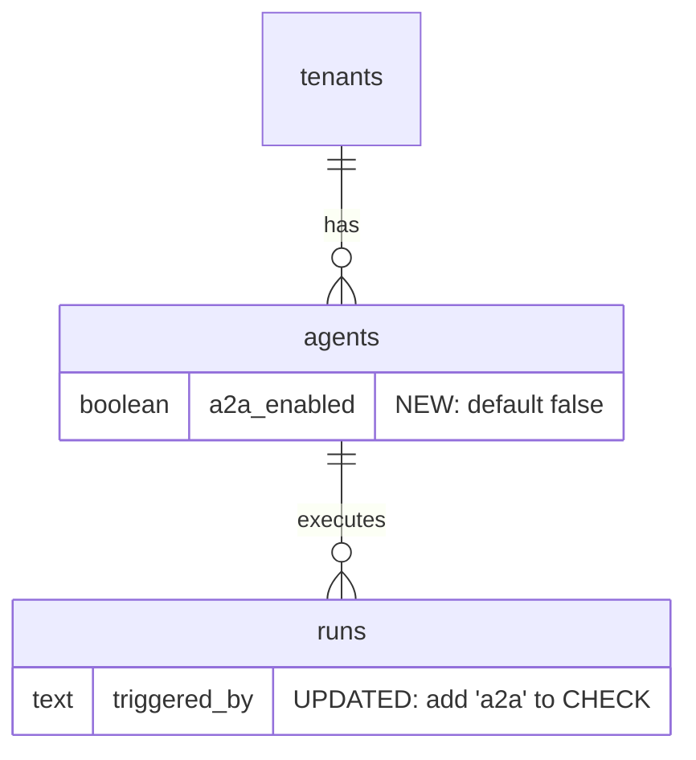

# feat: A2A Protocol Integration

## Enhancement Summary

**Deepened on:** 2026-03-10 (initial + SDK-focused deepening)
**Technical review #1:** 2026-03-10 (Architecture Strategist, Security Sentinel, Code Simplicity Reviewer, Agent-Native Reviewer, Learnings Researcher)
**SDK deepening:** 2026-03-10 (Architecture Strategist, Security Sentinel, Pattern Recognition Specialist + Context7 SDK docs audit)
**Technical review #2:** 2026-03-10 — 24 findings addressed (Architecture Strategist, Security Sentinel, Performance Oracle, Code Simplicity Reviewer, Agent-Native Reviewer)
**Agents used:** Security Sentinel, Architecture Strategist, Performance Oracle, TypeScript Reviewer, Data Integrity Guardian, Agent-Native Reviewer, Pattern Recognition Specialist, Deployment Verification, Best Practices Researcher, Framework Docs Researcher, Code Simplicity Reviewer

### Key Improvements

1. **Phase restructuring** — Phase 1 slimmed to 2 routes (Agent Card + JSON-RPC); multi-turn (Phase 2a) and push notifications (Phase 2b) separated
2. **Security hardening** — DNS-resolution-based SSRF with IP pinning + IPv6 transition normalization, webhook HMAC signing with delivery nonce, regex-based middleware bypass (Agent Card only), body size enforcement (Content-Length + streaming counter), budget clamping, UUID validation on all IDs, error sanitization in TaskStore, cross-key run scoping via `created_by_key_id`
3. **Performance** — Status-only `TaskStore.save()` (no JSONB history, no write amplification), Neon HTTP driver for all A2A reads, process-level Agent Card cache (60s TTL), exponential backoff polling (500ms→5s), poll-based blocking via detached sandbox
4. **Agent-native parity** — Complete parity table covering all REST capabilities (management ops explicitly out-of-scope), transcript URL + duration_ms in metadata, `a2a_list_tasks` MCP tool for Phase 3, session pre-warming in Phase 2a, idempotency on `message/send`
5. **Simplicity** — Use `@a2a-js/sdk` for types + client + server primitives, dropped custom metadata extensions (`cost_usd`/`usage`) from Phase 1, Phases 2/3 marked as directional outlines pending Phase 1 validation
6. **Data integrity** — Dynamic constraint lookup (migration 015 pattern), composite FKs, NOT VALID + VALIDATE pattern, `created_by_key_id` for per-key run scoping

### Critical Discoveries

- **SSRF via DNS rebinding** bypasses URL-level validation — must resolve DNS AND pin connection to resolved IP
- **Middleware bypass regex required** — prefix match `/api/a2a/` exempts ALL routes; must use Agent Card path regex only
- **`after()` cannot start execution for blocking SendMessage** — `after()` runs after response; sandbox runs detached, route polls DB
- **Blocking SendMessage must not hold DB connections** for 55s — use poll-based approach with detached sandbox
- **Migration 014 pattern is buggy** — must use dynamic PL/pgSQL constraint lookup from migration 015
- **`input-required` via XML tags is injectable** — user message could contain signal tags; prefer tool-based signaling
- **No body size limit = DoS** — A2A file parts with inline base64 require enforced max payload
- **`A2aTaskId` branded type uninhabitable** — intersection of two `__brand` properties; just use `RunId`
- **`RestTransportHandler` NOT exported** from `@a2a-js/sdk/server` — Express-only internal class; must use `JsonRpcTransportHandler` (Phase 1 = 2 routes, not 4)
- **Agent Card path is `.well-known/agent-card.json`** (SDK constant `AGENT_CARD_PATH`), NOT `.well-known/agent.json` — wrong path = clients can't discover agents
- **`TaskStore.save()` called on EVERY event** by SDK's `ResultManager.processEvent()` — cannot be a no-op; must implement real persistence
- **SDK performs NO input validation** — only checks `message.messageId` exists; must build validation layer for parts, role, contextId
- **SDK leaks `err.message`** from executor into A2A Task responses — must sanitize errors before they reach the SDK
- **`cancelTask(taskId, eventBus)` signature** — must publish canceled status + call `finished()` or streaming clients hang
- **`ClientFactory.createFromUrl()` double SSRF vector** (Phase 3) — fetches Agent Card URL, then uses URL FROM the card body; must inject SSRF-safe `fetchImpl` into both
- **Per-request `DefaultRequestHandler` required** for multi-tenant — constructor takes single `AgentCard`

---

## Overview

Add bidirectional A2A (Agent-to-Agent) protocol support to AgentPlane, enabling agents to be discovered and invoked by external A2A-compliant clients (server mode) and to call external A2A agents during execution (client mode). The A2A protocol (Linux Foundation) standardizes agent-to-agent communication with Agent Cards, Tasks, streaming, and push notifications — complementing MCP (agent-to-tool) with agent-to-agent interoperability.

## Problem Statement / Motivation

AgentPlane agents currently operate in isolation. There is no standard way for external agents (LangGraph, CrewAI, Semantic Kernel, etc.) to discover and invoke AgentPlane agents, nor for AgentPlane agents to delegate work to external agents. The A2A protocol provides an open standard for this interoperability, and adopting it positions AgentPlane as a first-class citizen in the emerging multi-agent ecosystem.

## Proposed Solution

Use the official **`@a2a-js/sdk`** (v0.3.12) for protocol types, client, and server primitives. Build thin Next.js App Router wrappers around the SDK's lower-level APIs (Express middleware doesn't work in App Router). Implement a custom `TaskStore` backed by our runs table and a custom `AgentExecutor` that triggers sandbox execution. For outbound A2A calls, the SDK's `A2AClient` handles transport negotiation and streaming natively.

(see brainstorm: docs/brainstorms/2026-03-10-a2a-protocol-integration-brainstorm.md)

### SDK: `@a2a-js/sdk`

**Package:** `@a2a-js/sdk@0.3.12` — official A2A protocol SDK (A2A Protocol Spec v0.3.0). **Pin exact version** (pre-1.0, breaking changes expected). Add to `npm audit` CI.

> **IMPORTANT: SDK uses `kind` not `type`** for discriminated unions — `kind: 'text'`, `kind: 'message'`, `kind: 'task'`, `kind: 'status-update'`, `kind: 'artifact-update'`.

**What we use from the SDK:**

| SDK Export | Our Usage |
|---|---|
| Types (`Message`, `Task`, `AgentCard`, `Part`, `TaskState`, `Artifact`, etc.) | Use directly — eliminates hand-rolled Zod schemas for A2A protocol types |
| `JsonRpcTransportHandler` | Single JSON-RPC endpoint handling all A2A operations. Returns `JSONRPCResponse \| AsyncGenerator` — AsyncGenerator for streaming methods |
| `DefaultRequestHandler` | Constructed per-request with tenant-specific `AgentCard`. Orchestrates `TaskStore`, `AgentExecutor`, and `EventBus` |
| `AgentExecutor` interface | Implement with our sandbox execution logic (`SandboxAgentExecutor`) |
| `DefaultExecutionEventBus` | Provided to executor via `eventBus` parameter — do NOT create your own |
| `ServerCallContext` | Construct per-request with tenant-aware `User` after auth. Flows to `TaskStore.save/load` |
| `A2AError` static factories | Use `taskNotFound()`, `invalidParams()`, `internalError()` for spec-compliant JSON-RPC errors |
| `AGENT_CARD_PATH` | Constant for well-known path: `.well-known/agent-card.json` (NOT `agent.json`) |
| `A2AClient` + `ClientFactory` (Phase 3) | Outbound calls — **must inject SSRF-safe `fetchImpl`** (see Phase 3) |

**What is NOT available (confirmed via SDK source audit):**

| SDK Class | Status |
|---|---|
| `RestTransportHandler` | **NOT exported** from `@a2a-js/sdk/server` — internal to Express middleware only. Cannot use in Next.js App Router. |
| `UserBuilder` | Express-only auth. We use our own `authenticateA2aRequest()` |
| `DefaultPushNotificationSender` | Has NO SSRF protection. `_dispatchNotification` is private (can't override). Implement `PushNotificationSender` from scratch in Phase 2b. |

**What we still build ourselves:**
- Next.js App Router route handlers (2 routes: Agent Card + JSON-RPC)
- `RunBackedTaskStore` — implements SDK `TaskStore` (`save`/`load`) backed by runs DB with RLS
- `SandboxAgentExecutor` — implements SDK `AgentExecutor` with sandbox execution + error sanitization
- **Input validation layer** — SDK performs NO validation on message content (only checks `messageId`). Must validate parts, role, contextId format, referenceTaskIds count
- Auth (`authenticateA2aRequest`) → construct `ServerCallContext` with tenant `User`
- Tenant isolation, budget/concurrency checks, run lifecycle
- Per-tenant Agent Card construction (SDK takes one card per `DefaultRequestHandler` — create handler per-request)

### Research Insights: Protocol Binding

- **Phase 1: JSON-RPC only.** `RestTransportHandler` is not exported from the SDK server package. `JsonRpcTransportHandler` is properly exported and handles ALL A2A operations (send-message, get-task, cancel-task, streaming) through a single `POST` endpoint. Add REST binding in Phase 2 if clients request it.
- **JSON-RPC is the canonical binding** — Google ADK, LangChain, CrewAI all use JSON-RPC. The SDK's `A2AClient` defaults to it.
- **For outbound calls (Phase 3), the SDK's `A2AClient` handles transport negotiation** — no need to hard-code protocol.
- **Include `A2A-Version` header** on all responses.
- **Source:** [A2A Protocol Specification](https://a2a-protocol.org/latest/specification/), [a2a-js SDK](https://github.com/a2aproject/a2a-js)

## Technical Approach

### Architecture

```
External A2A Client                      AgentPlane A2A Server
    │                                         │
    │  GET /.well-known/agent-card.json       │
    │────────────────────────────────────────►│  → Agent Card (a2a_enabled agents as skills)
    │                                         │
    │  POST /jsonrpc  {method: 'message/send'}│
    │────────────────────────────────────────►│  → SDK JsonRpcTransportHandler dispatches:
    │  ◄─── JSON-RPC Response                 │     message/send → createRun (poll-based blocking)
    │       or AsyncGenerator (streaming)     │     message/stream → createRun + SSE stream
    │                                         │     tasks/get, tasks/cancel

AgentPlane Agent (in sandbox)             External A2A Agent
    │                                         │
    │  MCP tool: a2a_send_message             │
    │────────────────────────────────────────►│  → SDK A2AClient (auto-negotiates transport)
    │  ◄─── tool result (A2A Task)            │
```

### Database Schema Changes

**Phase 1 schema changes only** (Phase 3 `a2a_connections` table defined in its own section):



### Implementation Phases (Revised)

> **Phase restructuring rationale:** The simplicity review identified push notifications and multi-turn as over-engineering for Phase 1. A minimal A2A server (Agent Card + send + stream + get + list + cancel) is a complete, shippable feature. Multi-turn and push notifications move to Phase 2 once the basic protocol is validated with real clients.

#### Phase 1: Minimal A2A Server (2 routes)

**1.1 Database Migration (`src/db/migrations/016_a2a_support.sql`)**

- Add `a2a_enabled BOOLEAN NOT NULL DEFAULT FALSE` to `agents` (safe: Postgres 11+ lazy default, no table rewrite)
- Add `created_by_key_id UUID REFERENCES api_keys(id) ON DELETE SET NULL` to `runs` (nullable — existing runs have no key tracking). Used by A2A `tasks/get` and `tasks/cancel` to scope visibility to the API key that created the run.
- Update `triggered_by` CHECK: add `'a2a'`

**CRITICAL: Use dynamic PL/pgSQL constraint lookup (migration 015 pattern, NOT migration 014 pattern):**

```sql
DO $$
DECLARE
  r RECORD;
BEGIN
  FOR r IN
    SELECT con.conname
    FROM pg_constraint con
    JOIN pg_attribute att ON att.attrelid = con.conrelid AND att.attnum = ANY(con.conkey)
    WHERE con.conrelid = 'runs'::regclass
      AND con.contype = 'c'
      AND att.attname = 'triggered_by'
  LOOP
    EXECUTE format('ALTER TABLE runs DROP CONSTRAINT %I', r.conname);
  END LOOP;
END $$;

ALTER TABLE runs ADD CONSTRAINT runs_triggered_by_check
  CHECK (triggered_by IN ('api', 'schedule', 'playground', 'chat', 'a2a'))
  NOT VALID;
ALTER TABLE runs VALIDATE CONSTRAINT runs_triggered_by_check;
```

> Migration 014 used hardcoded constraint name guesses; migration 015 cleaned up with dynamic lookup. Migration 016 MUST use the dynamic pattern.

**1.2 Types & Validation**

In `src/lib/types.ts`:
```typescript
// Add to RunTriggeredBy union
export type RunTriggeredBy = 'api' | 'schedule' | 'playground' | 'chat' | 'a2a';

// A2A task IDs ARE run IDs — no separate branded type needed. Use RunId throughout.
```

In `src/lib/validation.ts`:
- Add `'a2a'` to `RunTriggeredBySchema`
- Add `a2a_enabled: z.boolean()` to `AgentRowInternal` and `AgentRow` Zod schemas (without this, the field is silently dropped during `queryOne()` validation)

**A2A protocol types — use `@a2a-js/sdk` directly:**
```typescript
// All A2A types come from the SDK — no hand-rolled Zod schemas needed
import type { Message, Task, AgentCard, Part, TextPart, TaskState, Artifact, AgentSkill } from '@a2a-js/sdk';

// TaskState from SDK already defines: "submitted" | "working" | "input-required" |
// "completed" | "canceled" | "failed" | "rejected" | "auth-required" | "unknown"
```

**Status mapping — exhaustive with `never` guard (maps our RunStatus → SDK TaskState):**
```typescript
import type { TaskState } from '@a2a-js/sdk';

export function runStatusToA2a(status: RunStatus): TaskState {
  switch (status) {
    case "pending":   return "working";
    case "running":   return "working";
    case "completed": return "completed";
    case "failed":    return "failed";
    case "cancelled": return "canceled"; // Note: AgentPlane "cancelled" (2 L) → A2A "canceled" (1 L)
    case "timed_out": return "failed";
    default: { const _: never = status; throw new Error(`Unhandled: ${_}`); }
  }
}
```

> **No custom Zod schemas for A2A types.** The SDK defines `Message`, `Part`, `Task`, `AgentCard`, etc. We validate inbound requests using the SDK's `DefaultRequestHandler` which handles protocol validation internally. We only add Zod validation for AgentPlane-specific extensions (e.g., `metadata.agentplane.max_budget_usd`).

**1.3 A2A Protocol Helpers (`src/lib/a2a.ts`)**

This module bridges AgentPlane concepts to `@a2a-js/sdk` types.

**Performance: Use Neon HTTP driver for ALL A2A read queries** (auth lookups, Agent Card construction, `tasks/get`, poll status). This keeps the 5-connection DB pool available for transactional writes. The HTTP driver is already available via `getHttpClient()` in `src/db/index.ts`.

Helpers:

- `buildAgentCard(tenant, agents): AgentCard` — construct SDK `AgentCard` from tenant + a2a_enabled agents. Include `capabilities: { streaming: true, pushNotifications: false }` (explicitly false in Phase 1). Use **agent name** as skill ID (unique per tenant). Populate `AgentSkill` entries: `description` from agent's `description` field (required — enforce non-null for a2a_enabled agents), `inputModes: ['text']`, `outputModes: ['text']` (Phase 1 TextPart only). Include agent's `max_runtime_seconds` in skill description to help external agents estimate task duration.
- `runToA2aTask(run): Task` — map AgentPlane `Run` to SDK `Task`. **Phase 1: single TextPart artifact** containing the final result text only. Include `metadata.agentplane.transcript_url` and `metadata.agentplane.duration_ms`. Defer `cost_usd` and `usage` metadata to Phase 2 (no external A2A consumer knows about these proprietary extensions yet — add when real clients request it).
- `runStatusToA2a()` — status mapping (defined above, returns SDK `TaskState`)
- `RunBackedTaskStore` — implements the SDK's `TaskStore` interface backed by our runs DB table. Maps SDK `Task` CRUD operations to AgentPlane run queries.
- `SandboxAgentExecutor` — implements SDK's `AgentExecutor` interface. On `execute()`, creates a run via `createRun(triggered_by: 'a2a')`, starts sandbox execution, publishes run events to the SDK's `DefaultExecutionEventBus` as A2A streaming events.

> **Module boundary:** `validateExternalUrl()` and `isPrivateIp()` go in `src/lib/external-url.ts` (shared between Phase 2b webhooks and Phase 3 outbound A2A). `deliverWebhook()` and `signWebhookPayload()` go in `src/lib/webhooks.ts`. **Cross-phase dependency:** Whichever phase ships first (2b or 3) must create `external-url.ts`; the other phase imports from it. Do NOT pre-extract in Phase 1 — no outbound calls exist yet.

**1.4 A2A Auth (in `src/lib/auth.ts` — no separate file)**

Add `authenticateA2aRequest(req, tenantSlug)` to existing `auth.ts`:
- **MUST validate `ap_live_`/`ap_test_` prefix** before hashing — A2A routes may bypass middleware prefix check
- Single query combining slug + key validation:
  ```sql
  SELECT ak.*, t.id as tenant_id FROM api_keys ak
  JOIN tenants t ON ak.tenant_id = t.id
  WHERE ak.key_hash = $1 AND t.slug = $2
  ```
- **MUST cross-check** slug-resolved tenant matches key's tenant (enforced by the JOIN)
- **Returns `AuthContext`** (same pattern as existing `authenticateApiKey()`). Does NOT set RLS context directly — let the route handler use `withTenantTransaction()` or pass tenant ID to query helpers. This follows the established codebase pattern.
- Also returns `keyId` for cross-key run scoping (Finding #9)
- Fire-and-forget `last_used_at` UPDATE (match existing `authenticateApiKey()` pattern)

### Research Insights: Auth Security

- **Timing attack risk:** The combined query ensures constant-time response regardless of slug validity (no two-step resolution).
- **Agent Card endpoint (no auth) must return uniform 404** for non-existent tenants AND tenants with zero a2a_enabled agents — prevents tenant enumeration. Set `Cache-Control: public, max-age=300` on 404 responses (CDN caches both success and failure — prevents timing oracle without server-side negative caching).
- **Rate limit Agent Card** aggressively (60 req/min per IP) since it is unauthenticated.
- **Rate limit authenticated A2A endpoints** (100 req/min per tenant) — concurrent run limit (10) provides partial protection, but auth+validation compute is consumed by rejected requests.
- Use **agent name** as skill ID in Agent Card (unique per tenant, human-readable, no reverse-lookup needed). Opaque hashed IDs add lookup complexity without meaningful security benefit since UUIDs are random, not secrets.

**1.5 A2A Server Routes (`src/app/api/a2a/[slug]/...`)**

Route structure (2 routes for Phase 1):

```
src/app/api/a2a/[slug]/
  .well-known/agent-card.json/route.ts     GET  → Agent Card (no auth, rate limited)
  jsonrpc/route.ts                         POST → JSON-RPC endpoint (SDK JsonRpcTransportHandler → DefaultRequestHandler)
```

> **Simplified via SDK:** The SDK's `JsonRpcTransportHandler` accepts a JSON-RPC request body and dispatches ALL A2A operations (message/send, message/stream, tasks/get, tasks/cancel) through a single `POST` endpoint. For streaming methods, it returns an `AsyncGenerator` which we pipe as SSE. `RestTransportHandler` is NOT exported from the SDK — JSON-RPC is the only binding for Phase 1. Only the Agent Card endpoint is fully custom (per-tenant card construction).

> **ListTasks deferred:** `GET /tasks` is deferred from Phase 1. A2A clients that create tasks already have the task ID. To enable `GET /api/runs?triggered_by=a2a` as a REST fallback, add a `triggeredBy` filter parameter to `listRuns()` in `src/lib/runs.ts` (currently only supports `agentId`, `sessionId`, `status`). Add A2A ListTasks in Phase 2a if real clients request it.

**All routes MUST:**
- Export `dynamic = "force-dynamic"`
- Export `maxDuration = 60` on JSON-RPC route (55s poll + overhead; Vercel default is 10s)
- Use `withErrorHandler()` wrapper
- Call `authenticateA2aRequest()` (except Agent Card) — returns `AuthContext`, route manages RLS
- Verify `a2a_enabled` on target agent before creating runs
- Include `A2A-Version: 1.0` header in responses (static — log unrecognized client `A2A-Version` headers for future protocol version signals)
- **Enforce max request body size (1MB)** via `Content-Length` header check + streaming byte counter that aborts at 1MB (Next.js App Router has no built-in body size limit)

**Route implementations:**

| Route | Logic |
|---|---|
| `GET .well-known/agent-card.json` | No auth. Rate limited (60 req/min per IP). Resolve tenant by slug via Neon HTTP driver (not pool). Return uniform 404 for missing/empty tenants. `Cache-Control: public, max-age=300` on success AND 404 (CDN caches both — prevents timing oracle without server-side negative caching infrastructure). Build `AgentCard` via `buildAgentCard()`. Set `pushNotifications: false` explicitly in capabilities (Phase 1 does not support push). |
| `POST jsonrpc` | Auth (returns `AuthContext` with `keyId`). Rate limited (100 req/min per tenant — **known gap: in-memory rate limiter is per-instance on Vercel; upgrade to Vercel KV for production hardening**). Max 1MB body (Content-Length + streaming byte counter). **Validate inbound message** (parts array non-empty, role is 'user', each `referenceTaskId` is valid UUID v4, contextId: UUID format max 128 chars alphanumeric+hyphens). **Validate `taskId` as UUID v4** before passing to TaskStore/Executor (return `A2AError.invalidParams()`). **Clamp `metadata.agentplane.max_budget_usd`** to `min(requested, agent_default, tenant_remaining_budget)` — never allow external clients to exceed agent's configured limit. Cache `AgentCard` per tenant with 60s TTL (process-level `Map`, matches existing MCP/plugin cache pattern). Create `DefaultRequestHandler` per-request with cached `AgentCard` + `RunBackedTaskStore` + `SandboxAgentExecutor`. Create `ServerCallContext` with tenant `User` after auth. Create `JsonRpcTransportHandler` wrapping the request handler. Call `transportHandler.handle(body, context)`. Returns `JSONRPCResponse` (blocking) or `AsyncGenerator` (streaming — pipe as SSE with heartbeats every 15s). For blocking `message/send`: the executor polls run status with exponential backoff (500ms→5s) via Neon HTTP driver until complete or 55s timeout, then publishes final task via event bus. **Do NOT use `after()`** for execution start. Use `A2AError` static factories for protocol errors (`taskNotFound()`, `invalidParams()`, `internalError()`). **Scope `tasks/get` and `tasks/cancel` to the API key that created the run** via `created_by_key_id` filter (prevents cross-key visibility within a tenant). |

**`SandboxAgentExecutor` implementation:**
```typescript
import type { AgentExecutor, RequestContext, ExecutionEventBus } from '@a2a-js/sdk/server';

class SandboxAgentExecutor implements AgentExecutor {
  async execute(requestContext: RequestContext, eventBus: ExecutionEventBus): Promise<void> {
    // 1. Validate taskId as UUID v4 (return A2AError.invalidParams() if invalid)
    // 2. Publish immediate "working" status BEFORE any async work
    //    eventBus.publish({ kind: 'status-update', taskId, state: 'working' })
    // 3. Extract prompt from requestContext.userMessage (kind: 'message', parts array)
    // 4. createRun(triggered_by: 'a2a', created_by_key_id: from AuthContext), taskId = requestContext.taskId
    // 5. prepareRunExecution() → returns { sandbox, logIterator }
    //    Sandbox starts detached (runner runs independently)
    //
    // === TWO EXECUTION PATHS (determined by SDK based on JSON-RPC method) ===
    //
    // PATH A — Blocking (message/send):
    //   6a. Poll run status every 500ms→5s (exponential backoff, cap 5s)
    //       Use Neon HTTP driver (no pool connection held)
    //   7a. On terminal status: build final Task, publish via eventBus, finished()
    //   8a. On 55s timeout: publish Task with "working" status, finished()
    //   NOTE: Do NOT consume logIterator — only poll DB status
    //
    // PATH B — Streaming (message/stream):
    //   6b. Consume logIterator (live NDJSON events from sandbox stdout)
    //   7b. Map each NDJSON event to A2A event and publish to eventBus:
    //       - text_delta → statusUpdate with "working"
    //       - result → artifactUpdate with TextPart
    //   8b. On stream end: publish terminal status, finished()
    //
    // === ERROR HANDLING (both paths) ===
    // - Sanitize ALL errors — never leak stack traces, file paths, SQL
    // - Catch errors → publish "failed" with generic message → finished()
    // - ALWAYS call finished(), even on error (streaming clients hang otherwise)
  }

  async cancelTask(taskId: string, eventBus: ExecutionEventBus): Promise<void> {
    // 1. Validate taskId as UUID v4 (return A2AError.taskNotFound() if invalid)
    // 2. Cancel the run (create cancelRun() helper wrapping transitionRunStatus + sandbox stop)
    await cancelRun(taskId as RunId);
    // 3. MUST publish canceled status AND call finished() — streaming clients hang otherwise
    // eventBus.publish({ kind: 'status-update', taskId, state: 'canceled' })
    // eventBus.finished()
  }
}
```

**`RunBackedTaskStore` implementation:**
```typescript
import type { TaskStore, ServerCallContext } from '@a2a-js/sdk/server';
import type { Task } from '@a2a-js/sdk';

class RunBackedTaskStore implements TaskStore {
  async load(taskId: string, context?: ServerCallContext): Promise<Task | undefined> {
    // Validate taskId as UUID v4 before querying (return undefined for invalid format)
    // Query runs table via Neon HTTP driver (not pool) with tenant RLS
    // Map to SDK Task via runToA2aTask()
    // Reconstruct task.history from transcript blob (lazy — only on load, not save)
    // Return undefined for missing tasks (SDK maps to taskNotFound error)
  }

  async save(task: Task, context?: ServerCallContext): Promise<void> {
    // CRITICAL: SDK's ResultManager calls save() on EVERY event (50-200 per run)
    //
    // DESIGN: Status-only UPDATE — do NOT persist full task history on each save.
    // The runs table is the source of truth for status; the transcript blob stores
    // full event history. This avoids write amplification (500+ writes/sec at 10
    // concurrent runs would exhaust the 5-connection DB pool).
    //
    // Implementation:
    // 1. Extract task.status.state → map to RunStatus via a2aToRunStatus()
    // 2. UPDATE runs SET status = $1 WHERE id = $2 AND tenant_id = $3
    //    (lightweight single-column update, no JSONB, no version check)
    // 3. Use Neon HTTP driver for the write (avoids pool contention)
    //
    // ERROR HANDLING — CRITICAL:
    // SDK leaks err.message from TaskStore into JSON-RPC responses.
    // Wrap ALL DB operations in try/catch. NEVER throw errors containing
    // SQL, connection strings, or internal identifiers.
    // On failure: log the real error, throw A2AError.internalError("Internal storage error")
  }
}
```

### Research Insights: Blocking SendMessage

**Problem:** `Promise.race()` with a 55s timer holds a DB connection for the entire duration. With `max: 5` pool connections, 5 concurrent blocking requests exhaust the pool.

**Solution:** Poll-based approach with detached sandbox execution:
1. Create run (quick DB transaction, release connection)
2. Call `prepareRunExecution()` → `createSandbox()` starts runner in detached mode (sandbox runs independently once created — see `sandbox.ts:308-313`)
3. Poll run status every 2-3s with lightweight Neon HTTP driver query (no pool connection)
4. Return on completion or 55s timeout

**CRITICAL: Do NOT use `after()` to start execution.** `after()` in Next.js defers work until after the response stream closes. For blocking SendMessage, the response has NOT been sent yet. The sandbox's detached execution model is the correct approach.

**Source:** Performance Oracle + Architecture Strategist analysis — reduces connection hold time from 55s to ~50ms per poll.

**1.6 Middleware Update (`src/middleware.ts`)**

**Do NOT add `/api/a2a/` to `PUBLIC_PATHS`** (too broad — prefix match would exempt ALL A2A routes from auth, not just the Agent Card).

**MUST use a specific regex** for the Agent Card path only:
```typescript
const A2A_AGENT_CARD_PATTERN = /^\/api\/a2a\/[^/]+\/\.well-known\/agent-card\.json$/;

// In middleware:
if (A2A_AGENT_CARD_PATTERN.test(pathname)) {
  return NextResponse.next(); // Agent Card is public
}
// All other /api/a2a/ routes pass through middleware Bearer format check
```

All other A2A routes pass through the existing middleware, which enforces Bearer token format (`ap_live_`/`ap_test_`/`ap_admin_` prefix check) as defense-in-depth. Then `authenticateA2aRequest()` performs full slug+key auth in the route handler.

**1.7 Vercel Config (`vercel.json`)**

- Add `supportsCancellation: true` for A2A streaming routes:
  ```json
  "app/api/a2a/**": { "supportsCancellation": true }
  ```

**1.8 Admin UI Updates**

- `run-source-badge.tsx`: add `'a2a'` variant (indigo color)
- `run-charts.tsx`: include `'a2a'` in chart data
- Agent edit page: add `a2a_enabled` toggle
- Agent detail: "A2A" section showing Agent Card preview + endpoint URL

**1.9 SDK Updates**

- Add `a2a_enabled` to `CreateAgentParams` and `UpdateAgentParams` in `sdk/src/types.ts`
- Add `a2a_enabled` field to `Agent` response type
- No new SDK resource for Phase 1 (A2A is accessed via protocol, not SDK)

**1.10 Observability**

- Log A2A auth attempts (success/failure) with source IP and tenant slug
- Log rate limit hits on Agent Card and authenticated endpoints
- Include `triggered_by: 'a2a'` in all structured run logs (already present via run creation)
- `A2A-Request-Id` header for request tracing (generate if not provided by client)

**1.11 Tenant Slug Immutability**

- Document that tenant slugs are immutable once the Agent Card URL is shared externally
- Agent Card URL (`/api/a2a/{slug}/...`) breaks if slug changes
- If slug changes are ever needed, add a redirect mechanism (out of scope for Phase 1)

**1.12 Idempotency**

- **Include in Phase 1.** A2A clients are automated systems that retry on network failure. Without idempotency, retries create duplicate runs. Infrastructure already exists in `src/lib/idempotency.ts`.
- Wire `Idempotency-Key` header support on `message/send` JSON-RPC method. Reuse existing `withIdempotency()` helper.

#### Phase 2a: Multi-Turn (contextId → Sessions)

> **Phase split rationale:** Multi-turn (reuses existing session infrastructure) and push notifications (new table, webhook delivery, retry cron, HMAC signing) have very different complexity profiles. Shipping them separately reduces deployment blast radius.

> **Simplicity note:** Phases 2/3 below are directional outlines. Re-deepen with `/deepen-plan` when Phase 1 ships and is validated with real clients. Specific implementation details (retry schedules, table schemas, tool signatures) should be confirmed against Phase 1 learnings before implementation.

**2a.1 Database Migration (`src/db/migrations/017_a2a_multiturn.sql`)**

- Add `a2a_context_id TEXT` to `sessions`
- Create partial unique index (MUST use `CREATE UNIQUE INDEX`, not table constraint):
  ```sql
  CREATE UNIQUE INDEX idx_sessions_tenant_a2a_context
    ON sessions (tenant_id, a2a_context_id)
    WHERE a2a_context_id IS NOT NULL;
  ```

**2a.2 Multi-Turn via contextId**

New JSON-RPC methods (added to existing `jsonrpc/route.ts` — no new route files):
```
message/send                             # Updated: handle contextId → session mapping
tasks/list                               # ListTasks (deferred from Phase 1)
```

Context management routes (REST — separate from A2A protocol, under `/api/a2a/{slug}/`):
```
GET  /api/a2a/{slug}/contexts            # List active A2A sessions
GET  /api/a2a/{slug}/contexts/{ctxId}    # Get session + message history
POST /api/a2a/{slug}/contexts            # Pre-warm session (create idle sandbox)
DELETE /api/a2a/{slug}/contexts/{ctxId}  # Stop session
```

> **Protocol note:** Context management is NOT part of the A2A spec — these are AgentPlane-specific REST endpoints. Keep them under `/api/a2a/{slug}/` for URL consistency, but document that they require REST-style HTTP (not JSON-RPC). A2A-native operations (list tasks, send with contextId) go through JSON-RPC.

> **Known gap (Phase 1):** A2A cannot create an idle session (pre-warm sandbox) before the first message. REST users can `POST /api/sessions` with no prompt. First A2A message in a conversation pays the cold-start penalty (~5-10s). **Phase 2a adds `POST /api/a2a/{slug}/contexts`** for session pre-warming (listed in route table above).

**contextId session lookup — use INSERT ON CONFLICT (not SELECT FOR UPDATE):**
```typescript
// Fast path: non-locking SELECT
const existing = await query('SELECT * FROM sessions WHERE tenant_id = $1 AND a2a_context_id = $2', ...);
if (existing) {
  // Verify agent_id matches — prevent cross-agent contextId reuse
  if (existing.agent_id !== agentId) throw new ValidationError('contextId belongs to a different agent');
  if (existing.status === 'stopped') throw new ConflictError('Session stopped');
  return existing;
}
// Slow path: atomic create
const result = await query(`
  INSERT INTO sessions (tenant_id, agent_id, status, a2a_context_id)
  SELECT $1, $2, 'creating', $3
  WHERE (SELECT COUNT(*) FROM sessions WHERE tenant_id = $1 AND status IN ('creating','active','idle')) < $4
  ON CONFLICT (tenant_id, a2a_context_id) WHERE a2a_context_id IS NOT NULL DO NOTHING
  RETURNING *
`, ...);
if (!result) { /* retry SELECT — another request created it */ }
```

**`input-required` signal mechanism — prefer tool-based signaling over XML tags:**

**Option A (Recommended): Dedicated tool**
- Register a `a2a_signal_status` MCP tool in the sandbox when `triggered_by: 'a2a'` and `contextId` is present
- Agent calls `a2a_signal_status({ status: "input-required", reason: "Need clarification on..." })` as final action
- Appears as unambiguous `tool_use` event in transcript — easy to parse, no injection risk
- If agent completes without calling the tool, default to `completed`

**Option B (Fallback): System prompt injection with safeguards**
- Inject XML tag instructions into system prompt (as originally planned)
- **CRITICAL:** Only parse signal from the LAST assistant turn — prevents injection via user-supplied A2A message content containing `<a2a_status>completed</a2a_status>`
- Use collision-resistant delimiter (e.g., `<agentplane_a2a_status>` instead of generic `<a2a_status>`)
- If no signal found, default to `completed` (safe default)

#### Phase 2b: Push Notifications

**2b.1 Database Migration (`src/db/migrations/018_a2a_push_notifications.sql`)**

- Create `a2a_push_notification_configs` table:
  - `run_id UUID NOT NULL REFERENCES runs(id) ON DELETE CASCADE`
  - `tenant_id UUID NOT NULL` (denormalized for RLS)
  - `webhook_url TEXT NOT NULL CHECK (length(webhook_url) <= 2048)`
  - `webhook_auth_encrypted BYTEA` (nullable)
  - `webhook_signing_secret_encrypted BYTEA NOT NULL` (server-generated, min 32 bytes crypto random)
  - `status TEXT NOT NULL CHECK (status IN ('pending', 'delivered', 'failed'))`
  - `retry_count INTEGER NOT NULL DEFAULT 0 CHECK (retry_count BETWEEN 0 AND 3)`
  - RLS, `GRANT TO app_user`, `updated_at` trigger

**2b.2 Push Notification Implementation**

- `src/lib/webhooks.ts`: `validateExternalUrl()` (shared for webhook URLs AND a2a_connections), `deliverWebhook()`, `signWebhookPayload()`
- Push notification CRUD routes + cron retry endpoint
- **Push delivery in A2A route layer** (NOT in `transitionRunStatus()`) via `after()` — keeps A2A logic in A2A layer, avoids extra query on all non-A2A runs
- Cron: `LIMIT 50 FOR UPDATE SKIP LOCKED` + **batch `unnest()` for status updates** (no per-item UPDATE — matches institutional learning)
- **Webhook URL validation:** At registration AND at delivery time (DNS records change — TOCTOU protection)
- **Log delivery attempts** (timestamp, HTTP status, truncated response) for debugging — simple log output, not a queryable storage system

### Research Insights: SSRF Prevention

**DNS-resolution-based validation is mandatory** — URL-level checks are bypassed by DNS rebinding, IPv6 representations, and decimal IP notation.

```typescript
// Correct SSRF validation pattern with IP pinning:
async function validateAndConnect(url: string): Promise<Response> {
  const parsed = new URL(url);
  if (parsed.protocol !== 'https:') throw new ValidationError('HTTPS required');

  // Step 1: Resolve DNS BEFORE connecting
  const ips = await dns.resolve4(parsed.hostname).catch(() => []);
  const ip6s = await dns.resolve6(parsed.hostname).catch(() => []);
  const allIps = [...ips, ...ip6s];
  if (allIps.length === 0) throw new ValidationError('DNS resolution failed');

  for (const ip of allIps) {
    if (isPrivateIp(ip)) throw new ValidationError('Private IP not allowed');
  }

  // Step 2: CRITICAL — Connect to resolved IP directly via custom Agent
  // Do NOT let fetch() re-resolve DNS (TOCTOU / DNS rebinding attack)
  const agent = new https.Agent({
    lookup: (_hostname, _options, callback) => {
      callback(null, allIps[0], allIps[0].includes(':') ? 6 : 4);
    },
  });
  return fetch(url, {
    dispatcher: agent,
    redirect: 'error', // Do NOT follow redirects
    headers: { Host: parsed.hostname },
  });
}
```

**Block ALL of:** RFC 1918 (`10/8`, `172.16/12`, `192.168/16`), RFC 6598 (`100.64/10`), loopback (`127/8`, `::1`), link-local (`169.254/16`, `fe80::/10`), cloud metadata (`169.254.169.254`, `fd00:ec2::254`), multicast, IPv4-mapped IPv6 (`::ffff:*`), **current network (`0.0.0.0/8`)**, **unspecified (`[::]`)**, **NAT64 (`64:ff9b::/96`)**, **Teredo (`2001:0000::/32`)**, **6to4 (`2002::/16`)**, **SIIT (`::ffff:0:0/96`)**.

**CRITICAL: `isPrivateIp()` MUST normalize IPv6 transition addresses.** IPv4-mapped IPv6 (`::ffff:127.0.0.1`), NAT64, Teredo, and 6to4 addresses all encode IPv4 addresses in IPv6 form. The function must: (a) normalize all IPv4-mapped/translated IPv6 forms to their IPv4 equivalent before checking, (b) use an **allowlist approach** (only permit globally routable unicast) rather than a denylist, to catch novel encodings.

**Dual validation:** Validate at registration time (catch obvious mistakes) AND at request time (catch DNS changes). This applies to both webhook URLs (Phase 2b) and outbound A2A connections (Phase 3).

**Sources:** OWASP SSRF Prevention Cheat Sheet, Semgrep A2A Security Guide, CVE-2026-27127 (DNS rebinding TOCTOU).

### Research Insights: Webhook Delivery

- **HMAC-SHA256 signing** on all webhook payloads with per-config signing secret (server-generated, min 32 bytes crypto random) + timestamp for replay protection
- **Replay window: ±5 minutes** — document this tolerance for webhook receivers
- **Retry schedule with jitter:** 30s, 5m, 30m, 2h, then give up (compressed vs Stripe's 3-day window — A2A tasks are shorter-lived)
- **Log delivery attempts** (timestamp, HTTP status, truncated response) for debugging — structured log output, not queryable storage
- **Idempotency:** Include delivery ID in payload for receiver deduplication
- **Source:** Stripe/GitHub/Slack webhook patterns, Svix best practices

#### Phase 3: A2A Client

**3.1 Database Migration (`src/db/migrations/019_a2a_connections.sql`)**

- Create `a2a_connections` table
- **Composite FK** `(agent_id, tenant_id) REFERENCES agents(id, tenant_id) ON DELETE CASCADE` — prevents cross-tenant references (established codebase pattern)
- RLS with NULLIF fail-closed pattern, `GRANT TO app_user`, `updated_at` trigger
- **SSRF validate `remote_agent_url`** on creation/update (reuse `validateExternalUrl` from webhooks.ts)

**3.2 A2A MCP Tool Server**

Build using `@modelcontextprotocol/sdk` for the MCP server layer, and `@a2a-js/sdk/client` for outbound A2A calls:
```typescript
import { McpServer } from "@modelcontextprotocol/sdk/server/index.js";
import { StdioServerTransport } from "@modelcontextprotocol/sdk/server/stdio.js";
import { ClientFactory } from "@a2a-js/sdk/client";
```

> **Key simplification:** The SDK's `A2AClient` handles transport negotiation (JSON-RPC vs REST based on remote Agent Card's `preferredTransport`), streaming, agent discovery, and error handling. Our MCP tools become thin wrappers around the SDK client.

Tools:

| Tool | Parameters | Returns |
|---|---|---|
| `a2a_discover` | `connection_id: string` | Agent Card JSON (via SDK `AgentCardResolver`) |
| `a2a_send_message` | `connection_id: string, skill_id: string, message: string` | A2A Task JSON (via SDK `client.sendMessage()`) |
| `a2a_get_task` | `connection_id: string, task_id: string` | A2A Task JSON (via SDK `client.getTask()`) |
| `a2a_cancel_task` | `connection_id: string, task_id: string` | Confirmation (via SDK `client.cancelTask()`) |
| `a2a_list_tasks` | `connection_id: string, status?: string` | Array of recent A2A Tasks dispatched to this connection (enables recovery after context truncation — agent can re-discover in-flight work) |

```typescript
// MCP tool implementation using SDK client
server.tool("a2a_send_message", schema, async ({ connection_id, skill_id, message }) => {
  const config = loadConnection(connection_id); // from credential file
  // CRITICAL: Inject SSRF-safe fetchImpl into BOTH ClientFactory AND transport factories
  // ClientFactory.createFromUrl() fetches Agent Card, then uses URL FROM the card body for transport
  // Both fetches must use validateAndConnect() to prevent DNS rebinding SSRF
  const client = await new ClientFactory({ fetchImpl: ssrfSafeFetch }).createFromUrl(config.url);
  const response = await client.sendMessage({
    message: { messageId: uuidv4(), role: 'user', kind: 'message',
               parts: [{ kind: 'text', text: message }] },
    skillId: skill_id,
  });
  return { content: [{ type: "text", text: JSON.stringify(response) }] };
});
```

**Credential isolation:**
- **Preferred: Pass credentials via stdin/pipe** to MCP server at startup (avoids filesystem entirely). MCP server reads from stdin on init, stores in memory, pipe is then closed — no file to leak.
- **Fallback (if pipe not supported): Write to tmpfs + immediate unlink.** MCP server opens file, reads credentials, then the file is unlinked (even while the fd is still open, the data is accessible only via the fd, not the filesystem). This eliminates the TOCTOU race where the agent process reads the credential file before it's deleted.
- The MCP server **hard-codes credential scrubbing** in tool results and error messages (not behavioral — the agent could try to make the tool echo credentials)
- **Note:** Vercel Sandbox processes run as the same user — `chmod 600` provides zero isolation between agent and MCP server. File-based credential storage with a separate delete step is NOT sufficient.

**SDK updates (Phase 3 deliverable):**
- Add `a2aConnections` resource to SDK `AgentPlane` class
- Add CRUD methods matching the admin API for A2A connections

**Outbound protocol:** The SDK's `A2AClient` auto-negotiates transport based on the remote agent's Agent Card `preferredTransport` field — no need to hard-code JSON-RPC.

**3.3 Sandbox Integration (`src/lib/sandbox.ts`)**

- Write A2A connection config to a restricted file in sandbox (not env var)
- Extend network allowlist with hostnames from `a2a_connections` URLs (SSRF-validated at registration time)
- Add A2A MCP stdio server to sandbox configuration

#### Future Considerations

> Not a planned "Phase 4" — these are potential enhancements if demand materializes.

- Extended Agent Card (authenticated, richer metadata per agent, schedule visibility)
- OAuth 2.0 support for A2A connections (outbound)
- gRPC binding for A2A server (SDK supports it, just need to mount the handler)
- Cross-agent trace IDs for observability
- A2A connection health monitoring
- Agent Card signing (digital signatures to prevent spoofing)
- `a2a_discover_remote` tool for runtime agent discovery (enables autonomous composition)
- Streaming outbound tool (`a2a_send_streaming_message`) for long-running external tasks
- Per-API-key A2A scope restriction (key can/cannot be used for A2A)

## System-Wide Impact

### Interaction Graph

1. A2A request → middleware regex check (Agent Card public, JSON-RPC requires Bearer) → `authenticateA2aRequest()` (prefix validation + single-query slug+key) → construct `ServerCallContext` with tenant `User` → tenant RLS → create per-request `DefaultRequestHandler` with tenant `AgentCard` → `JsonRpcTransportHandler.handle()` dispatches to correct operation → `SandboxAgentExecutor.execute()` → `createRun(triggered_by: 'a2a')` → `prepareRunExecution()` (sandbox starts detached) → poll status → publish events to `ExecutionEventBus` → `finished()` → `runToA2aTask()` with cost/transcript metadata
2. (Phase 2a) Multi-turn: A2A request with contextId → non-locking session lookup → `INSERT ON CONFLICT` if needed → `executeSessionMessage()` → tool-based `input-required` signal
3. (Phase 2b) Push notification: A2A route `after()` → query push configs → `deliverWebhook()` with HMAC signing + IP-pinned SSRF validation → cron retries failures

### Error Propagation

- Auth failures → 401 HTTP (no A2A Task)
- Budget/concurrency exceeded → A2A Task with `rejected` status (no run record — ephemeral response)
- Agent not `a2a_enabled` → 404 (same as non-existent agent)
- Run failures → A2A Task with `failed` status + sanitized message (no stack traces, paths, or SQL)
- `timed_out` → A2A `failed` with message "Agent execution timed out"
- (Phase 2a) Stopped session via contextId → `failed` with "Session expired"
- (Phase 2b) Webhook failures → logged, retried, marked `failed` after max retries

### State Lifecycle Risks

- **Orphaned push configs (Phase 2b):** `ON DELETE CASCADE` FK on `run_id` handles cleanup
- **Stale session from contextId (Phase 2a):** Return A2A Task with `failed` status, message "Session stopped — use a new contextId"
- **Webhook retry after run cleanup (Phase 2b):** Cron query JOINs to `runs` — skips configs with no live run
- **Cross-key run visibility:** Mitigated in Phase 1 via `created_by_key_id` column. `tasks/get` and `tasks/cancel` filter by the API key that created the run. Runs created via REST or other channels have `created_by_key_id = NULL` and are not visible via A2A `tasks/get`.

### API Surface Parity

> **Design decision:** A2A is an *execution protocol*, not a management protocol. Agent CRUD, skills, plugins, connectors, API keys, and tenant management are intentionally out-of-scope for A2A — these are management operations handled by the REST API. The A2A protocol covers discovery (Agent Card) and task execution (send/stream/get/cancel).

| Capability | REST API | A2A (Phase 1) | A2A (Phase 2a/2b/3) | Notes |
|---|---|---|---|---|
| **Execution** | | | | |
| Create run | Yes | Yes (message/send) | Yes | |
| Stream run | Yes | Yes (message/stream) | Yes | |
| Get run | Yes | Yes (tasks/get) | Yes | |
| List runs | Yes | No (add `triggeredBy` filter to REST) | Yes (ListTasks in 2a) | |
| Cancel run | Yes | Yes (tasks/cancel) | Yes | |
| Get transcript | Yes (inline) | Partial (`metadata.agentplane.transcript_url`) | Yes | **Transcript URL requires REST auth** — pure A2A clients cannot access. Document this. Consider adding transcript content in Task artifact in Phase 2. |
| Cost/usage data | Yes (Run object) | Yes (`metadata.agentplane.transcript_url`) | Yes | `cost_usd` and `usage` deferred to Phase 2 (no external consumers yet) |
| Multi-turn | Yes (sessions) | No | Yes (2a: contextId → sessions) | |
| Session pre-warm | Yes (`POST /sessions` no prompt) | No | 2a: add `POST contexts` | Known gap — first A2A message pays cold-start |
| Session lifecycle | Full CRUD | No | 2a: contexts list/get/delete | |
| Push notifications | No | No | Yes (2b) | |
| Cross-key isolation | N/A | Yes (`created_by_key_id` filter) | Yes | |
| **Discovery** | | | | |
| Agent Card | No | Yes (`.well-known/agent-card.json`) | Yes | |
| List agents | Yes | Via Agent Card skills | Via Agent Card skills | Agent Card is the A2A discovery mechanism |
| Get agent detail | Yes | Partial (skill description) | Partial | |
| **Management (out of scope)** | | | | |
| Agent CRUD | Yes | N/A | N/A | Management API — not an A2A concern |
| Skills/Plugins CRUD | Yes | N/A | N/A | Management API |
| Connectors/MCP | Yes | N/A | N/A | Management API |
| API key management | Yes | N/A | N/A | Management API |
| Tenant info | Yes | N/A | N/A | Management API |
| Plugin marketplace | Yes | N/A | N/A | Management API |
| **Outbound (Phase 3)** | | | | |
| Discover remote agent | No | No | Yes (a2a_discover tool) | |
| Send to remote agent | No | No | Yes (a2a_send_message tool) | |
| List remote tasks | No | No | Yes (a2a_list_tasks tool) | Enables recovery after context truncation |
| Cancel remote task | No | No | Yes (a2a_cancel_task tool) | |

### Integration Test Scenarios

1. **Full A2A round-trip:** Discover Agent Card (verify agent name as skill ID) → send message → receive streaming response → poll GetTask → verify completed status with TextPart artifact + cost metadata + transcript URL
2. **Blocking timeout fallback:** Send message to slow agent → 55s elapses → receive `working` status → poll GetTask → eventually see `completed`
3. **Budget rejection:** Send message when tenant budget exhausted → receive `rejected` task
4. **Budget override:** Send message with `metadata.agentplane.max_budget_usd` → verify budget applied to run
5. **Agent not a2a_enabled:** Send message targeting non-A2A agent → 404
6. **Tenant enumeration prevention:** GET Agent Card for non-existent slug → same 404 response as slug-with-no-agents
7. **Body size limit:** Send message > 1MB → 413 rejection
8. **Rate limit enforcement:** Exceed 100 req/min per tenant → 429 response
9. (Phase 2a) **Multi-turn:** Send with contextId → `input-required` (via tool signal) → follow-up → `completed`
10. (Phase 2a) **Concurrent contextId creation:** Two simultaneous requests → one session, both succeed
11. (Phase 2b) **Webhook delivery + retry:** Register webhook → run completes → webhook received → verify HMAC signature within ±5 min window

## Acceptance Criteria

### Phase 1 Functional Requirements

- [x] Agent Card at `GET /api/a2a/{slug}/.well-known/agent-card.json` listing `a2a_enabled` agents (agent name as skill ID)
- [x] Uniform 404 for non-existent tenants and tenants with zero a2a_enabled agents (`Cache-Control: public, max-age=300` on 404s too)
- [x] JSON-RPC `message/send` creates run, returns A2A Task (or `working` after 55s). `max_budget_usd` clamped to `min(requested, agent_default, tenant_remaining)`
- [x] JSON-RPC `message/stream` streams `text/event-stream` SSE with A2A format (via `AsyncGenerator` from `JsonRpcTransportHandler`)
- [x] JSON-RPC `tasks/get` returns task with final-result TextPart artifact + `metadata.agentplane.transcript_url` + `duration_ms`
- [x] JSON-RPC `tasks/cancel` cancels underlying run
- [x] `tasks/get` and `tasks/cancel` scoped to creating API key (`created_by_key_id`)
- [x] Input validation: parts array non-empty, role is 'user', taskId/referenceTaskIds are valid UUID v4, contextId format (UUID, max 128 chars)
- [x] `Idempotency-Key` header support on `message/send` (via existing `withIdempotency()`)
- [x] `a2a_enabled` toggle on agent edit page
- [x] Run source badge shows A2A trigger source
- [x] All routes use `withErrorHandler()`, `dynamic`; JSON-RPC route exports `maxDuration = 60`
- [x] Body size enforced via `Content-Length` check + streaming byte counter (1MB max)
- [x] SDK types include `a2a_enabled` on Agent, CreateAgentParams, UpdateAgentParams
- [x] `AgentRowInternal` and `AgentRow` Zod schemas include `a2a_enabled`
- [x] `authenticateA2aRequest()` returns `AuthContext` (matches existing auth pattern), does not set RLS directly
- [x] `RunBackedTaskStore.save()` is status-only UPDATE (no JSONB history, no version check). History derived from transcript on `load()`.
- [x] `RunBackedTaskStore` wraps all DB ops in try/catch — never throws SQL/internal details (uses `A2AError.internalError()`)
- [x] `SandboxAgentExecutor` has two explicit paths: poll-only for blocking, logIterator for streaming
- [x] Process-level Agent Card cache per tenant (60s TTL)
- [x] All A2A read queries use Neon HTTP driver (not pool)
- [x] `listRuns()` in `runs.ts` supports `triggeredBy` filter parameter

### Phase 1 Non-Functional Requirements

- [x] Agent Card p99 < 150ms (HTTP `Cache-Control: max-age=300` handles hot path)
- [x] Blocking SendMessage does not hold DB connections (poll-based via detached sandbox)
- [x] Streaming endpoints heartbeat every 15s (SSE comments)
- [x] Error responses never leak stack traces, file paths, or SQL
- [x] A2A auth/rate-limit events logged with source IP and tenant slug

### Phase 1 Security Requirements

- [x] Auth combines slug + key in single query (no timing attack) with `ap_live_`/`ap_test_` prefix validation
- [x] Middleware uses Agent Card path **regex** (not prefix match) — only Agent Card is public
- [x] Agent Card uses agent names as skill IDs (no internal UUIDs exposed)
- [x] Rate limiting: Agent Card (60 req/min per IP), authenticated endpoints (100 req/min per tenant). **Known gap:** in-memory rate limiter is per-Vercel-instance; document upgrade path to Vercel KV.
- [x] Request body size limit enforced (1MB max) via Content-Length + streaming byte counter
- [x] `A2A-Version: 1.0` header on all responses; log unrecognized client versions
- [x] GetTask enforces tenant RLS AND API key scoping (`created_by_key_id`)
- [x] `max_budget_usd` from A2A metadata clamped to `min(requested, agent_default, tenant_remaining)`
- [x] All taskId/referenceTaskIds validated as UUID v4 before DB queries
- [x] `RunBackedTaskStore.save()` never throws errors containing SQL, connection strings, or internal paths
- [x] `A2A-Request-Id` header sanitized (alphanumeric + hyphens, max 128 chars; regenerate if invalid)

### Quality Gates

- [x] Unit tests: status mapping (exhaustive `never` guard), Agent Card builder, auth cross-check, `RunBackedTaskStore`, `SandboxAgentExecutor`
- [x] Migration tested against existing data, uses dynamic constraint lookup
- [x] `npm run test` passes, `npm run build` succeeds
- [x] All existing tests continue to pass
- [x] `@a2a-js/sdk` types used for all A2A protocol structures (no hand-rolled duplicates)

## Deployment Checklist

### Pre-Deploy

```sql
-- Verify current triggered_by constraint name
SELECT con.conname, pg_get_constraintdef(con.oid)
FROM pg_constraint con JOIN pg_attribute att ON att.attrelid = con.conrelid AND att.attnum = ANY(con.conkey)
WHERE con.conrelid = 'runs'::regclass AND con.contype = 'c' AND att.attname = 'triggered_by';

-- Baseline row counts
SELECT (SELECT COUNT(*) FROM runs) as runs, (SELECT COUNT(*) FROM agents) as agents;
```

### Post-Deploy Verification

```sql
-- Verify a2a_enabled exists with correct default
SELECT column_name, column_default FROM information_schema.columns
WHERE table_name = 'agents' AND column_name = 'a2a_enabled';
-- Expected: false

-- Verify CHECK constraint includes 'a2a'
SELECT pg_get_constraintdef(oid) FROM pg_constraint
WHERE conrelid = 'runs'::regclass AND conname = 'runs_triggered_by_check';

-- Verify no data corruption
SELECT COUNT(*) FROM agents WHERE a2a_enabled = true; -- Expected: 0
```

### Smoke Tests

```bash
# Agent Card returns 404 for non-existent slug
curl -s -o /dev/null -w "%{http_code}" https://agentplane.vercel.app/api/a2a/nonexistent/.well-known/agent-card.json
# Expected: 404

# Agent Card returns 404 for slug with no a2a_enabled agents
curl -s -o /dev/null -w "%{http_code}" https://agentplane.vercel.app/api/a2a/{valid-slug}/.well-known/agent-card.json
# Expected: 404 (until an agent has a2a_enabled=true)

# Middleware does NOT exempt JSON-RPC endpoint
curl -s -o /dev/null -w "%{http_code}" -X POST \
  https://agentplane.vercel.app/api/a2a/{slug}/jsonrpc
# Expected: 401 (not 404 or 200)

# Body size limit on JSON-RPC endpoint
curl -s -o /dev/null -w "%{http_code}" -X POST \
  -H "Authorization: Bearer {key}" \
  -H "Content-Type: application/json" \
  -d '{"jsonrpc":"2.0","method":"message/send","params":{"message":{"messageId":"test","role":"user","kind":"message","parts":[{"kind":"text","text":"'"$(python3 -c "print('x'*2000000)")"'"}]}},"id":1}' \
  https://agentplane.vercel.app/api/a2a/{slug}/jsonrpc
# Expected: 413
```

### Rollback

Code revert is safe — new column has default, CHECK is additive, old code ignores new fields. Emergency SQL rollback available in deployment verification docs.

## Risk Analysis & Mitigation

| Risk | Impact | Phase | Mitigation |
|---|---|---|---|
| SSRF via DNS rebinding + IPv6 transition | Critical | 2b/3 | DNS-resolution + IP pinning, allowlist approach for `isPrivateIp()` (normalize IPv4-mapped, block NAT64/Teredo/6to4), no redirects, dual validation |
| SDK error leakage via TaskStore | Critical | 1 | `RunBackedTaskStore.save()` wraps all DB ops in try/catch, throws only `A2AError.internalError()` |
| Middleware bypass too broad | Critical | 1 | Regex-based Agent Card exemption only, not prefix match |
| DoS via large A2A payloads | Critical | 1 | 1MB max via Content-Length check + streaming byte counter |
| TaskStore write amplification | High | 1 | Status-only UPDATE in `save()` — no JSONB history, no version check. History from transcript on `load()` |
| In-memory rate limiter per-instance | High | 1 | Document as known gap. Upgrade to Vercel KV for production hardening. |
| Budget override via A2A metadata | High | 1 | Clamp `max_budget_usd` to `min(requested, agent_default, tenant_remaining)` |
| Agent Card tenant enumeration | High | 1 | Uniform 404, rate limiting, agent name as skill ID |
| Slug+key timing attack | High | 1 | Single-query auth (JOIN), constant-time response, `ap_live_`/`ap_test_` prefix validation |
| `after()` misuse for blocking SendMessage | High | 1 | Detached sandbox execution, poll DB status, do NOT use `after()` |
| Blocking SendMessage pool exhaustion | High | 1 | Poll-based waiting via Neon HTTP driver + exponential backoff (500ms→5s) |
| Migration 014 constraint bug repeat | High | 1 | Dynamic PL/pgSQL lookup (migration 015 pattern) |
| Cross-key run visibility | Medium | 1 | `created_by_key_id` column + filter on `tasks/get` and `tasks/cancel` |
| `input-required` signal injection | Medium | 2a | Prefer tool-based signaling; if XML tags, parse only last assistant turn with collision-resistant delimiter |
| Credential file TOCTOU race | Medium | 3 | Pass credentials via stdin/pipe to MCP server at startup, or write-to-tmpfs + immediate unlink after read |
| Webhook payload spoofing | Medium | 2b | HMAC-SHA256 signing with timestamp + delivery nonce in HMAC computation, ±5 min replay window |
| Tenant slug immutability | Medium | 1 | Document as requirement; Agent Card URLs break if slug changes |

## Future Considerations

- **REST binding** for A2A client compatibility (if `RestTransportHandler` is exported in a future SDK version, or build our own)
- **Extended Agent Card** with authenticated richer metadata, input/output JSON schemas
- **A2A OAuth** for inbound auth (client credentials flow)
- **Cross-agent tracing** via trace ID propagation
- **Agent Card signing** with digital signatures (prevents spoofing per Semgrep security guide)
- **A2A marketplace** for discovering public agents

## Documentation Plan

- API documentation for A2A endpoints (OpenAPI spec)
- Guide: "Exposing Your Agents via A2A"
- Guide: "Calling External A2A Agents"
- Update SDK README with A2A connection management
- Update CLAUDE.md with A2A architecture section

## Sources & References

### Origin

- **Brainstorm document:** [docs/brainstorms/2026-03-10-a2a-protocol-integration-brainstorm.md](docs/brainstorms/2026-03-10-a2a-protocol-integration-brainstorm.md) — Key decisions: bidirectional A2A, per-tenant Agent Cards, HTTP/REST binding, MCP tools for outbound, reuse API key auth, streaming + push notifications

### Internal References

- Run execution: `src/lib/run-executor.ts:35` (`prepareRunExecution`), `:83` (`finalizeRun`), `:129` (`executeRunInBackground`)
- Session lifecycle: `src/lib/sessions.ts:19` (`createSession`), `:92` (`transitionSessionStatus`)
- Session executor: `src/lib/session-executor.ts:185` (`executeSessionMessage`)
- Streaming: `src/lib/streaming.ts:13` (`createNdjsonStream`), `:98` (`ndjsonHeaders`)
- MCP config: `src/lib/mcp.ts:13` (`McpServerConfig`), `:24` (`buildMcpConfig`)
- Auth: `src/lib/auth.ts:19` (`authenticateApiKey`)
- Middleware: `src/middleware.ts:8` (public paths, prefix matching)
- Types: `src/lib/types.ts:17` (`RunTriggeredBy`)
- Validation: `src/lib/validation.ts:211` (`RunTriggeredBySchema`)
- Crypto: `src/lib/crypto.ts` (encrypt/decrypt, generateId)
- Errors: `src/lib/errors.ts` (AppError subclasses)
- Migration patterns: `src/db/migrations/014_sessions_table.sql`, `015_sessions_fixes.sql` (dynamic constraint lookup)
- Run source badge: `src/components/ui/run-source-badge.tsx`
- Sandbox network policy: `src/lib/sandbox.ts:214`
- DB pool config: `src/db/index.ts:13` (max: 5)

### External References

- [A2A Protocol Specification](https://a2a-protocol.org/latest/)
- [A2A Streaming & Async](https://a2a-protocol.org/latest/topics/streaming-and-async/)
- [Semgrep: Security Engineer's Guide to A2A](https://semgrep.dev/blog/2025/a-security-engineers-guide-to-the-a2a-protocol/)
- [Red Hat: A2A Security](https://developers.redhat.com/articles/2025/08/19/how-enhance-agent2agent-security)
- [OWASP SSRF Prevention](https://cheatsheetseries.owasp.org/cheatsheets/Server_Side_Request_Forgery_Prevention_Cheat_Sheet.html)
- [A2A JS SDK](https://github.com/a2aproject/a2a-js) — `@a2a-js/sdk@0.3.12` (types, server, client, streaming, push notifications)
- [MCP TypeScript SDK](https://github.com/modelcontextprotocol/typescript-sdk)
- [Next.js `after()` API](https://nextjs.org/docs/app/api-reference/functions/after)
- [Vercel Functions Duration Limits](https://vercel.com/docs/functions/configuring-functions/duration)

### Institutional Learnings

- Transcript capture: always preserve `result`/`error` events post-truncation (docs/solutions/logic-errors/transcript-capture-and-streaming-fixes.md)
- Batch SQL: use `unnest()` for bulk operations, not per-item updates
- Event type matrix: explicitly decide yield-vs-store behavior for each A2A event type
- Migration constraint drops: ALWAYS use dynamic PL/pgSQL lookup (migration 015 pattern)
